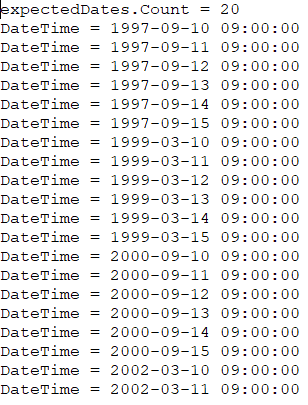

With Aspose.Email, it is possible to generate occurrences using a recurrence pattern. This article explains how, how to [generate the next occurrence](#calculate-the-next-occurrence-or-n-next-occurrences) and [get user friendly item descriptions](#get-user-friendly-text-for-a-recurrence). Occurrences from a MAPI calendar recurrence pattern can be generated using Aspose.Email. The following code snippet shows you how to generate occurrences from recurrence patterns.

## **Calculate the Next Occurrence or n Next Occurrences**
To get the "next" occurrence, use the GenerateOccurrences method with the parameter nNextOccurrences = 1. The following code snippet shows you how to generates 20 occurrences by using nNextOccurrences = 20. The output of the code below is as follows:

~~~Java
SimpleDateFormat sdf = new SimpleDateFormat("yyyy-MM-dd HH:mm:ss");

CalendarRecurrence recurrencePattern = new CalendarRecurrence();

recurrencePattern.setStartDate(sdf.parse("1997-09-10 09:00:00"));
RecurrenceRule rule = recurrencePattern.getRRules().add();
rule.setFrequency(Frequency.Monthly);
rule.setCount(20);
rule.setInterval(18);
rule.getByMonthDay().add(new int[] { 10, 11, 12, 13, 14, 15 });
DateCollection expectedDates = recurrencePattern.generateOccurrences(20);
System.out.println("expectedDates.Count = " + expectedDates.size());
for (int i = 0; i < expectedDates.size(); i++) {
    System.out.println("DateTime = " + sdf.format(expectedDates.getItem(i)));
}
~~~
## **Get User Friendly Text for a Recurrence**
User friendly text for a rule can be obtained using the FriendlyText property as shown below. The output of the code will be: "Recur every month on the 1st and 1st from end day(s) of the month for a maximum of 2 occurrences.". The following code snippet shows you how to get user friendly text for a recurrence.

~~~Java
RecurrenceRule rule = recurrencePattern.getRRules().add();
rule.setFrequency(Frequency.Monthly);
rule.setCount(2);
rule.getByMonthDay().add(1);
rule.getByMonthDay().add(-1);
System.out.println(rule.getFriendlyText());
~~~