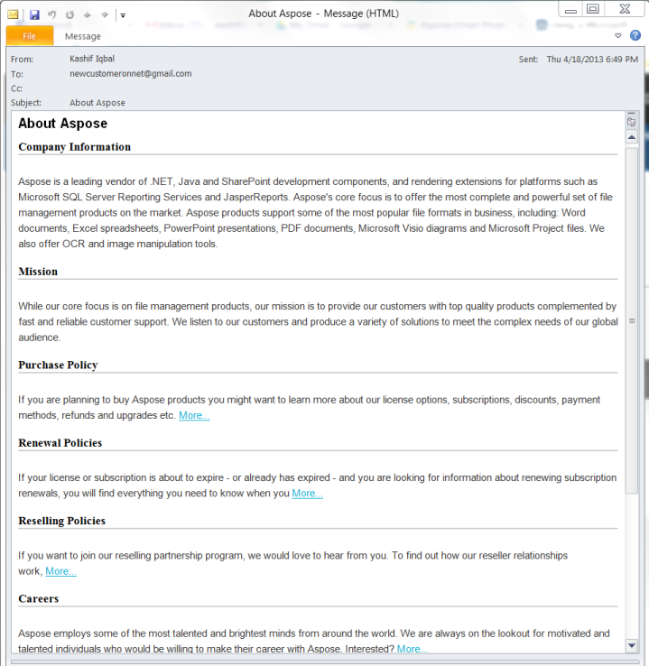
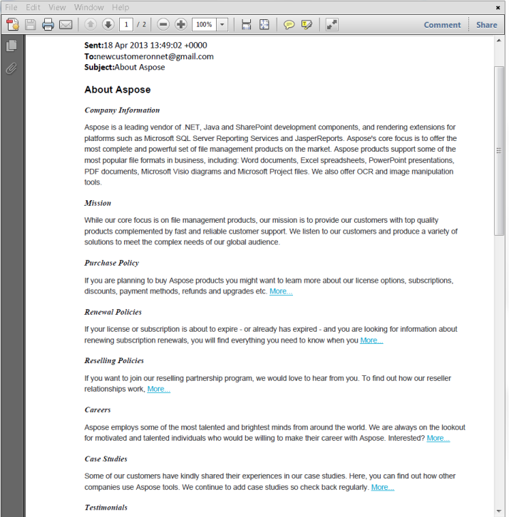

{} 

This article shows how to convert an email message to PDF using Aspose.Email.
Aspose.Email for Java deals Microsoft Outlook features, and can not handle direct conversion to PDF. To overcome this, the samples in this article use Aspose.Email to convert the email message to MHTML stream and then use Aspose.Words for Java to load the MHTML stream and then save it as PDF.

{} {} 

An email message can contain attachments as well. Since each attachment can be of different media type, Aspose.Email ignores these attachments while converting to MHTML i.e. only inline images in a message will be part of MHTML and any regular attachments will be ignored.

{} 
## **Convert Email message to PDF**
The following code shows converting email message to PDF using Aspose.Email in combination with Aspose.Words for Java. This involves the following steps:

1. Load the email message using MailMessage
1. Save the email message to MemoryStream as MHTML
1. Load the stream using Aspose.Words
1. Save the message as PDF

The source email message can be seen as follow:

||
| :- |
|**Figure: Source MSG File** |


||
| :- |
|**Figure: Converted PDF File** |
**Java**

``` java

 static void EmailToPdf(String emailPath) throws Exception

{

       FileInputStream fstream=new FileInputStream(emailPath);

       MailMessage eml = MailMessage.load(fstream);

       //Save the Message to output stream in MHTML format

       ByteArrayOutputStream emlStream = new ByteArrayOutputStream();

       eml.save(emlStream, SaveOptions.getDefaultMhtml());

       //Load the stream in Word document

       LoadOptions lo = new LoadOptions();

       lo.setLoadFormat(LoadFormat.MHTML);

       Document doc = new Document(new ByteArrayInputStream(emlStream.toByteArray()), lo);

       //Save to disc

       doc.save("About Aspose.Pdf", SaveFormat.PDF);

       //or Save to stream

       ByteArrayOutputStream foStream = new ByteArrayOutputStream();

       doc.save(foStream, SaveFormat.PDF);

}

```
