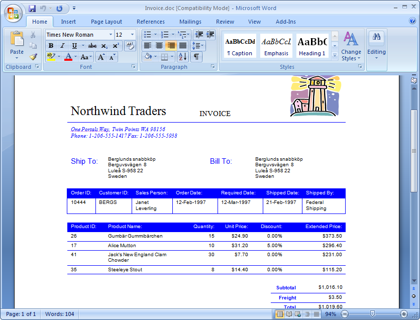
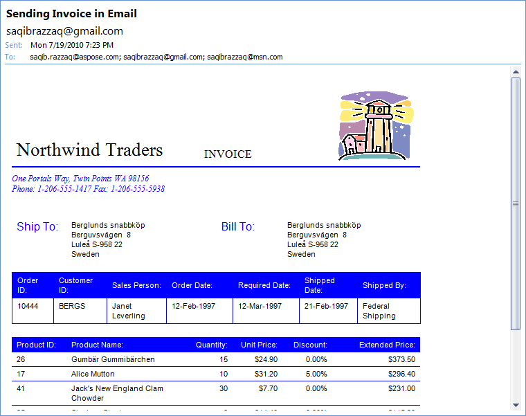
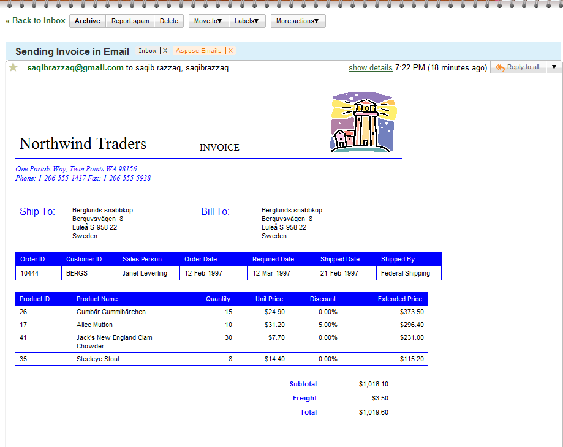

This article uses a Microsoft Word document as the email body and send it to recipients. The sample document is a sales invoice from the Northwind database sample, exported to Microsoft Word format. Aspose.Email for Java deals with network protocols and Microsoft Outlook features and cannot handle Microsoft Word documents. To overcome this, the samples in this article use Aspose.Words for Java to load the Word document and convert it to MHTML format. Aspose.Email for Java uses the MHTML document in the email body.
## **Using Microsoft Word Documents as Email Body**
The programming samples below illustrate how to send a Word document as an email body using Aspose.Words Java and Aspose.Email for Java:

1. Load a Microsoft Word document using Aspose.Word for Java class.
1. Save it in MHTML format.
1. Load the MHTML document using Aspose.Email for Java MailMessage class to set the email body.
1. Set other message properties using different MailMessage class properties and methods.
1. Send the email using Aspose.Email for Java SMTP Client class.

The source document, a sales invoice exported to Microsoft Word from the Microsoft Northwind sample can be seen below. 

When the message has been sent and received in Microsoft Outlook, it looks like the message below. 

The HTML formatting and images are preserved as in the original source document when viewed in either Outlook or a web email client like Gmail or Hotmail. Below is a screenshot of the message when opened with Gmail in a Chrome browser. 

The following code snippet shows you how to use a Microsoft Word document as the message body and sending email.

~~~Java
// The path to the File directory
String dataDir = "data/";

// Load a Word document from disk and save to stream as MHTML
Document wordDocument = new Document(dataDir + "Test.doc");
ByteArrayOutputStream mhtmlStream = new ByteArrayOutputStream();
wordDocument.save(mhtmlStream, SaveFormat.MHTML);

// Load the MHTML in MailMessage
MailMessage message = MailMessage.load(new ByteArrayInputStream(mhtmlStream.toByteArray()), new MhtmlLoadOptions());
message.setSubject("Sending Invoice in Email");
message.setFrom(new MailAddress("sender@gmail.com"));
message.setTo(MailAddressCollection.to_MailAddressCollection("recipient@gmail.com"));

// Save the message in MSG format to disk
message.save(dataDir + "WordDocAsEmailBody_out.msg", SaveOptions.getDefaultMsgUnicode());

// Send in an email
SmtpClient client = new SmtpClient("smtp.gmail.com", 587, "sender@gmail.com", "pwd");
client.setSecurityOptions(SecurityOptions.SSLExplicit);
client.send(message);
~~~