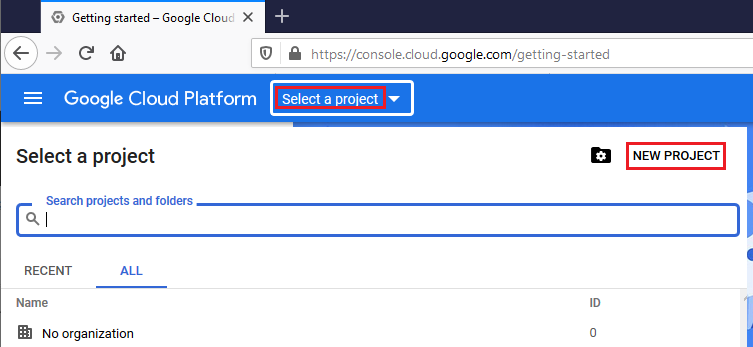
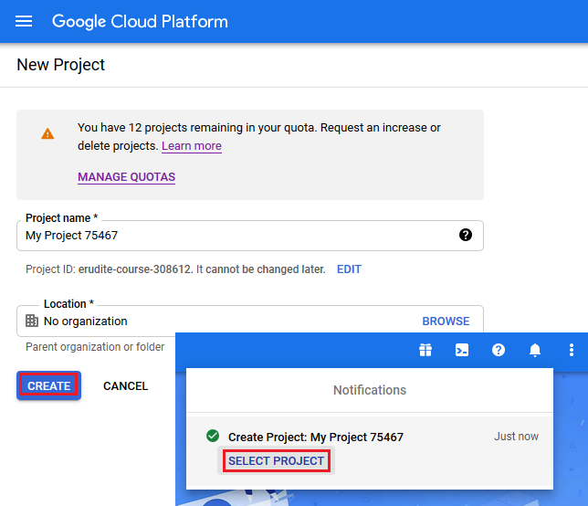
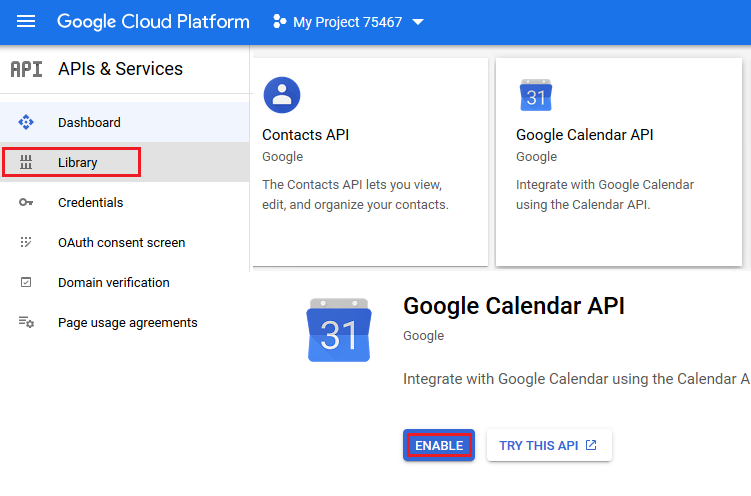
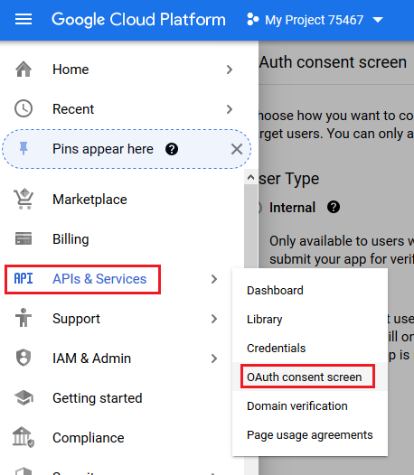
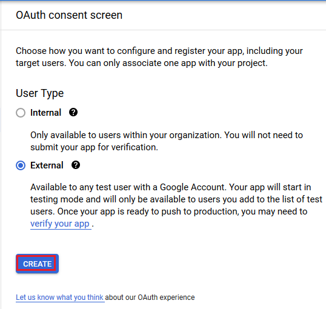
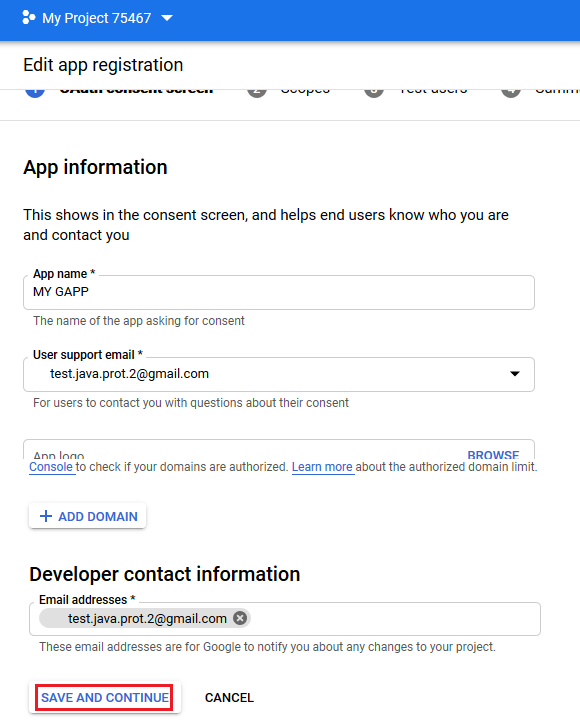
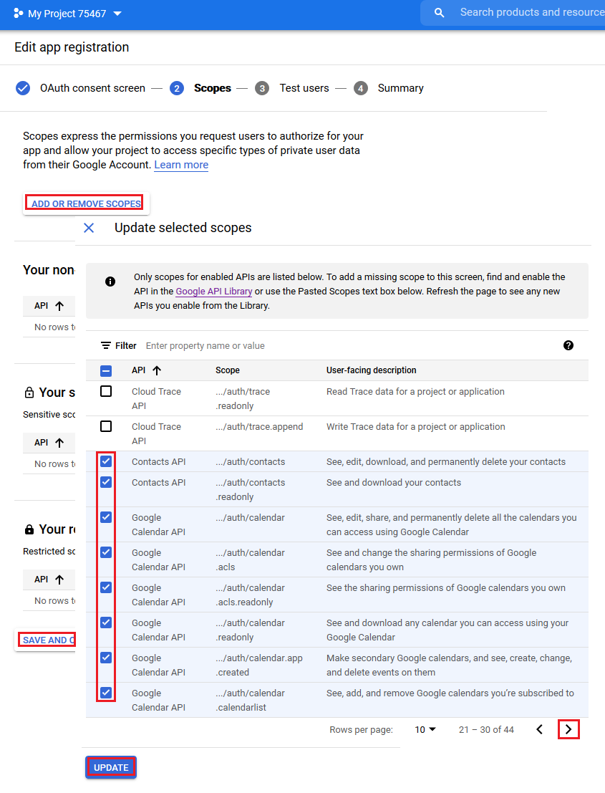
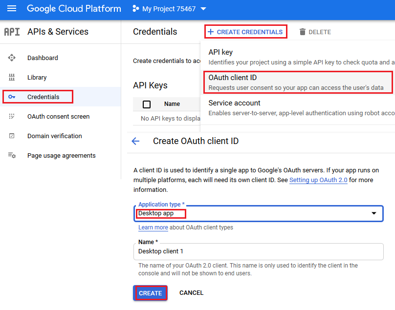
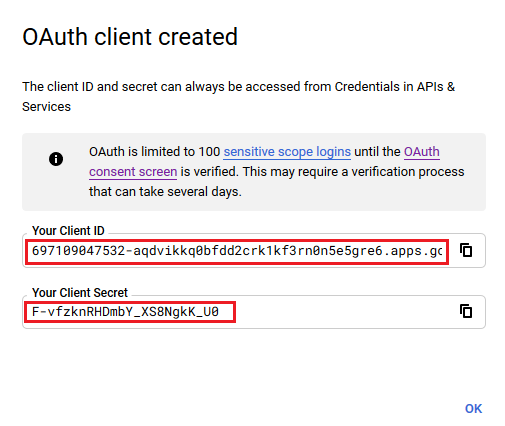

## **Working with FreeBusy Query**
Aspose.Email provides querying mechanism to check whether some appointment is due or not as per the criteria. [FreebusyQuery](https://apireference.aspose.com/email/java/com.aspose.email/FreebusyQuery) class is provided for this purpose which allows to prepare a query for a particular calendar.
### **Querying a Calendar**
This code sample demonstrates the feature of querying a calendar. Following tasks are performed in this sample:

1. Create and insert a calendar
1. Create an appointment
1. Insert appointment
1. Prepare a [FreebusyQuery](https://apireference.aspose.com/email/java/com.aspose.email/FreebusyQuery)
1. Get the [FreebusyResponse](https://apireference.aspose.com/email/java/com.aspose.email/FreebusyResponse)

~~~Java
IGmailClient client = GmailClient.getInstance(accessToken, "user@domain.com");
try {
    Calendar newCalendar = new Calendar("summary", null, null, "Europe/Kiev");

    // Insert calendar and get back id of newly inserted calendar and Fetch the same calendar using calendar id
    String id = client.createCalendar(newCalendar);
    Calendar fetchedCalendar = client.fetchCalendar(id);
    String calendarId = fetchedCalendar.getId();
    try {
        // Get list of appointments in newly inserted calendar. It should be zero
        Appointment[] appointments = client.listAppointments(calendarId);

        // Create a new appointment and Calculate appointment start and finish time
        java.util.Calendar c = java.util.Calendar.getInstance();
        Date startDate = c.getTime();
        c.add(java.util.Calendar.HOUR_OF_DAY, 1);
        Date endDate = c.getTime();

        // Create attendees list for appointment
        MailAddressCollection attendees = new MailAddressCollection();
        attendees.add("user1@domain.com");
        attendees.add("user2@domain.com");

        // Create appointment
        Appointment app1 = new Appointment("Location", startDate, endDate, MailAddress.to_MailAddress("user2@domain.com"), attendees);
        app1.setSummary("Summary");
        app1.setDescription("Description");
        app1.setStartTimeZone("Europe/Kiev");
        app1.setEndTimeZone("Europe/Kiev");

        // Insert the newly created appointment and get back the same in case of successful insertion
        Appointment newAppointment = client.createAppointment(calendarId, app1);

        // Create Freebusy query by setting min/max timeand time zone
        FreebusyQuery query = new FreebusyQuery();
        c = java.util.Calendar.getInstance();
        c.add(java.util.Calendar.DATE, -1);
        query.setTimeMin(c.getTime());
        c.add(java.util.Calendar.DATE, 2);
        query.setTimeMax(c.getTime());
        query.setTimeZone("Europe/Kiev");

        // Set calendar item to search and Get the reponse of query containing
        query.getItems().add(calendarId);
        FreebusyResponse resp = client.getFreebusyInfo(query);

        client.deleteAppointment(calendarId, newAppointment.getUniqueId());
    } finally {
        client.deleteCalendar(calendarId);
    }
} finally {
    client.dispose();
}
~~~
## **Creating Project in Google Developer Console**
A Project is to be created on Google Developer Console for a user having Gmail account. In the API & auth -> Credentials page of the Google project, information is to be noted like Client ID and Client Secret. This information along with the gmail account user name and password will be required for executing the code e.g. google calendar, access control lists, appointments, contacts, settings etc. in this section.
### **Steps to Create a Project in Google Developer Console**
Following is a step by step tutorial for creating a project in Google Developer Console.

1. Go to link <https://console.cloud.google.com> and login using your gmail credentials

2. Select the check box "I have read and agree to all Terms of Service for the Google Cloud Platform products." and Press **NEW PROJECT** button

3. **Create** and **Select** new project

4. Select **Library** and enable Contact and Calendar API

5. Open **OAuth consent screen**

6. Select **External** check box and Press **CREATE** button

7. Edit app registration and Press **SAVE AND CONTINUE** button

8. Add scopes and Press **UPDATE** button

9. Create OAuth credentials

10. Client ID and Client Secret here that will be used in the sample codes in this section.

## **Helper Classes**
Following helper classes are required to run the codes in this section. These classes are just for simplification of demonstration. The methods in these classes use non-public structure of web-pages that may change any time.
### **GoogleOAuthHelper Class**
The following code snippet shows you how to use GoogleOAuthHelper Class.

~~~Java
import java.io.BufferedReader;
import java.io.IOException;
import java.io.InputStream;
import java.io.InputStreamReader;
import java.io.OutputStream;
import java.io.UnsupportedEncodingException;
import java.net.HttpURLConnection;
import java.net.URL;
import java.net.URLDecoder;
import java.net.URLEncoder;
import java.nio.charset.StandardCharsets;
import java.security.MessageDigest;
import java.security.NoSuchAlgorithmException;
import java.util.HashMap;
import java.util.Map;
import java.util.UUID;

import javax.xml.bind.DatatypeConverter;

/**
 * 

 * Developers console https://console.developers.google.com/projectselector/apis/credentials?pli=1 
 * Documentation https://developers.google.com/identity/protocols/OAuth2InstalledApp
 * 

 */
class GoogleOAuthHelper {
    public static final String AUTHORIZATION_URL = "https://accounts.google.com/o/oauth2/v2/auth";
    public static final String TOKEN_REQUEST_URL = "https://oauth2.googleapis.com/token";
    public static final String REDIRECT_URI = "urn:ietf:wg:oauth:2.0:oob";
    public static final String REDIRECT_TYPE = "code";
    public static final String SCOPE = "https%3A%2F%2Fwww.googleapis.com%2Fauth%2Fcalendar" // Calendar
            + "+https%3A%2F%2Fwww.google.com%2Fm8%2Ffeeds%2F" // Contacts
            + "+https%3A%2F%2Fmail.google.com%2F"; // IMAP & SMTP

    static class OAuthUser {
        String email;
        String clientId;
        String clientSecret;
        String refreshToken;
    }

    static void getRefreshToken() {
        OAuthUser user = new OAuthUser();

        // Set clientId, clientSecret and email 
        user.clientId = "clientId";
        user.clientSecret = "clientSecret";
        user.email = "email";

        // Generate AuthorizationCodeUrl
        String authorizationCodeUrl = GoogleOAuthHelper.getAuthorizationCodeUrl(user);

        // You have to retrieve AuthorizationCode manually with generated AuthorizationCodeUrl
        // Copy "Code Verifier" from the previous step output
        String authorizationCode = "authorizationCode";
        String codeVerifier = "codeVerifier";

        // Get "Refresh Token"
        String refreshToken = GoogleOAuthHelper.getAccessTokenByAuthCode(authorizationCode, codeVerifier, user);

        // Get "Access Token"
        String accessToken = GoogleOAuthHelper.getAccessTokenByRefreshToken(user);
        
        // Use "Access Token" in API
        IGmailClient client = GmailClient.getInstance(accessToken, user.email);
    }

    static String createCodeChalange() {
        String verifierStr = UUID.randomUUID().toString() + "-" + UUID.randomUUID().toString();
        System.out.println("Code Verifier: " + verifierStr);

        MessageDigest digest;
        try {
            digest = MessageDigest.getInstance("SHA-256");
        } catch (NoSuchAlgorithmException e) {
            throw new IllegalAccessError(e.getMessage());
        }
        byte[] hash = digest.digest(verifierStr.getBytes(StandardCharsets.UTF_8));
        String base64Hash = DatatypeConverter.printBase64Binary(hash);

        base64Hash = base64Hash.split("=")[0];
        base64Hash = base64Hash.replace('+', '-').replace('/', '_');
        return base64Hash;
    }

    static String getAuthorizationCodeUrl(OAuthUser acc) {
        return getAuthorizationCodeUrl(acc, SCOPE, REDIRECT_URI, REDIRECT_TYPE);
    }

    static String getAuthorizationCodeUrl(OAuthUser acc, String scope, String redirectUri, String responseType) {
        System.out.println("---------------------------------------------------------");
        System.out.println("------------- OAuth 2.0 AuthorizationCodeUrl -------------");
        System.out.println("---------------------------------------------------------");
        System.out.println("Login: " + acc.email);
        String codeChallenge = createCodeChalange();

        String state = urlEncode(UUID.randomUUID().toString());
        String approveUrl = AUTHORIZATION_URL + "?client_id=" + acc.clientId + "&redirect_uri=" + redirectUri + "&response_type=" + responseType + "&scope=" + scope
                + "&code_challenge=" + codeChallenge + "&code_challenge_method=S256&state=" + state;

        System.out.println("Approve Url: " + approveUrl);
        return approveUrl;
    }

    static String urlEncode(String value) {
        try {
            return URLEncoder.encode(value, StandardCharsets.UTF_8.toString());
        } catch (UnsupportedEncodingException e) {
            throw new IllegalAccessError(e.getMessage());
        }
    }

    static String urlDecode(String value) {
        try {
            return URLDecoder.decode(value, StandardCharsets.UTF_8.toString());
        } catch (UnsupportedEncodingException e) {
            throw new IllegalAccessError(e.getMessage());
        }
    }

    static String getAccessTokenByAuthCode(String authorizationCode, String codeVerifier, OAuthUser user) {
        String encodedParameters = "client_id=" + urlEncode(user.clientId) + "&client_secret=" + urlEncode(user.clientSecret) + "&code=" + urlEncode(authorizationCode)
                + "&code_verifier=" + codeVerifier + "&redirect_uri=" + urlEncode(REDIRECT_URI) + "&grant_type=authorization_code";
        System.out.println("---------------------------------------------------------");
        System.out.println("------------- OAuth 2.0 AccessTokenByAuthCode -------------");
        System.out.println("---------------------------------------------------------");
        System.out.println("Authorization code: " + authorizationCode);

        String result = "";
        Map<String, String> token = geToken(encodedParameters);
        for (String key : token.keySet()) {
            System.out.println(key + ": " + token.get(key));
            if (key.equals("refresh_token")) {
                result = token.get(key);
            }
        }

        System.out.println("---------------------------------------------------------");

        return result;
    }

    static String getAccessTokenByRefreshToken(OAuthUser user) {
        String encodedParameters = "client_id=" + urlEncode(user.clientId) + "&client_secret=" + urlEncode(user.clientSecret) + "&refresh_token=" + urlEncode(user.refreshToken)
                + "&grant_type=refresh_token";
        System.out.println("---------------------------------------------------------");
        System.out.println("----------- OAuth 2.0 AccessTokenByRefreshToken -----------");
        System.out.println("---------------------------------------------------------");
        System.out.println("Login: " + user.email);

        String result = "";
        Map<String, String> token = geToken(encodedParameters);
        for (String key : token.keySet()) {
            System.out.println(key + ": " + token.get(key));
            if (key.equals("access_token")) {
                result = token.get(key);
            }
        }

        System.out.println("---------------------------------------------------------");

        return result;
    }

    static Map<String, String> geToken(String encodedParameters) {
        try {
            HttpURLConnection connection = (HttpURLConnection) new URL(TOKEN_REQUEST_URL).openConnection();
            connection.setRequestMethod("POST");

            byte[] requestData = encodedParameters.getBytes(StandardCharsets.UTF_8);

            connection.setUseCaches(false);
            connection.setDoInput(true);
            connection.setDoOutput(true);
            connection.setRequestProperty("Content-Type", "application/x-www-form-urlencoded");
            connection.setRequestProperty("Content-Length", "" + requestData.length);

            final OutputStream st = connection.getOutputStream();
            try {
                st.write(requestData, 0, requestData.length);
            } finally {
                st.flush();
                st.close();
            }

            connection.connect();

            if (connection.getResponseCode() >= HttpURLConnection.HTTP_BAD_REQUEST) {
                throw new IllegalAccessError("Operation failed: " + connection.getResponseCode() + "/" + connection.getResponseMessage() + "\r\nDetails:\r\n{2}"
                        + readInputStream(connection.getErrorStream()));
            }

            String responseText = readInputStream(connection.getInputStream());

            Map<String, String> result = new HashMap<String, String>();
            System.out.println(responseText);
            String[] strs = responseText.replace("{", "").replace("}", "").replace("\"", "").replace("\r", "").replace("\n", "").split(",");
            for (String sPair : strs) {
                String[] pair = sPair.split(":");
                String name = pair[0].trim().toLowerCase();
                String value = urlDecode(pair[1].trim());
                result.put(name, value);
            }

            return result;
        } catch (IOException e) {
            throw new IllegalAccessError(e.getMessage());
        }
    }

    static String readInputStream(InputStream is) {
        if (is == null)
            return "";

        BufferedReader reader = new BufferedReader(new InputStreamReader(is));
        StringBuilder result = new StringBuilder();
        String line;
        try {
            while ((line = reader.readLine()) != null) {
                result.append(line);
            }
        } catch (IOException e) {
            // ignore
        }
        return result.toString();
    }
}
~~~
