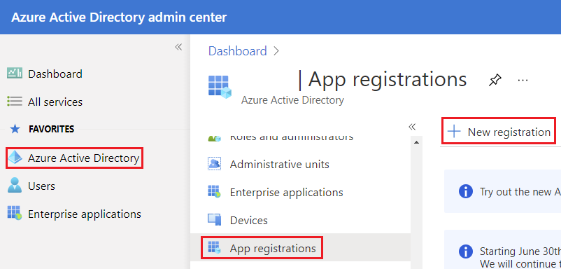
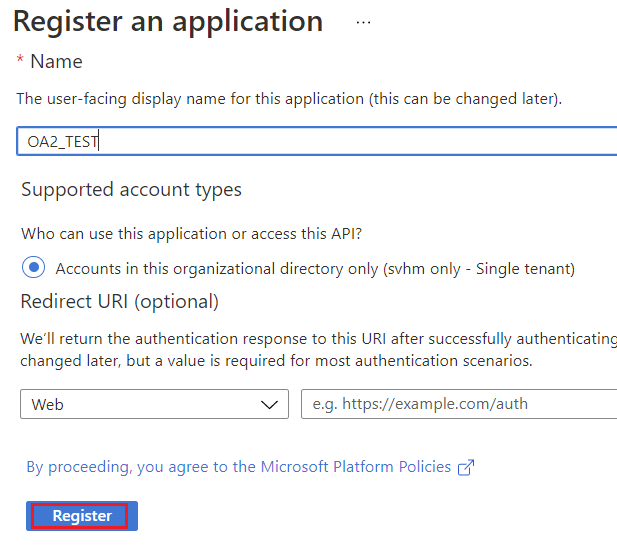
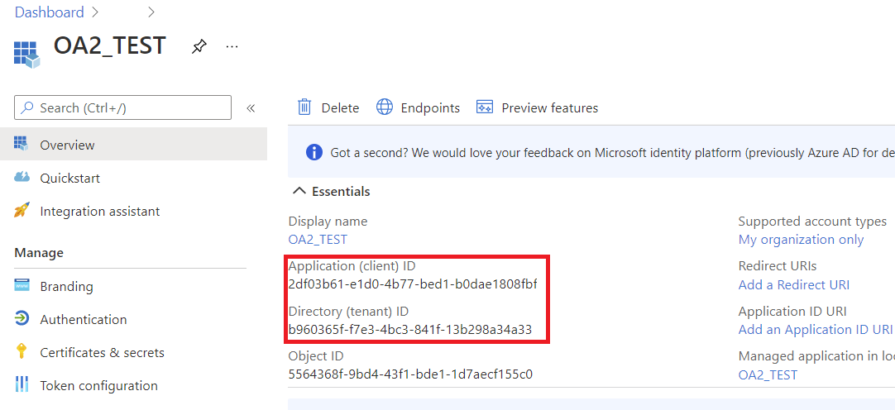
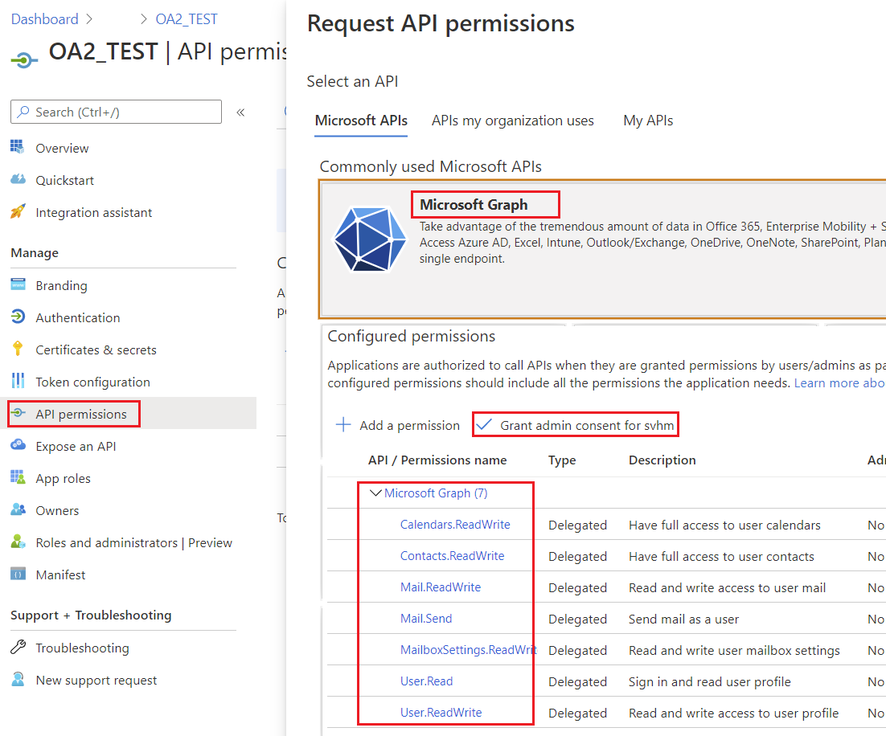
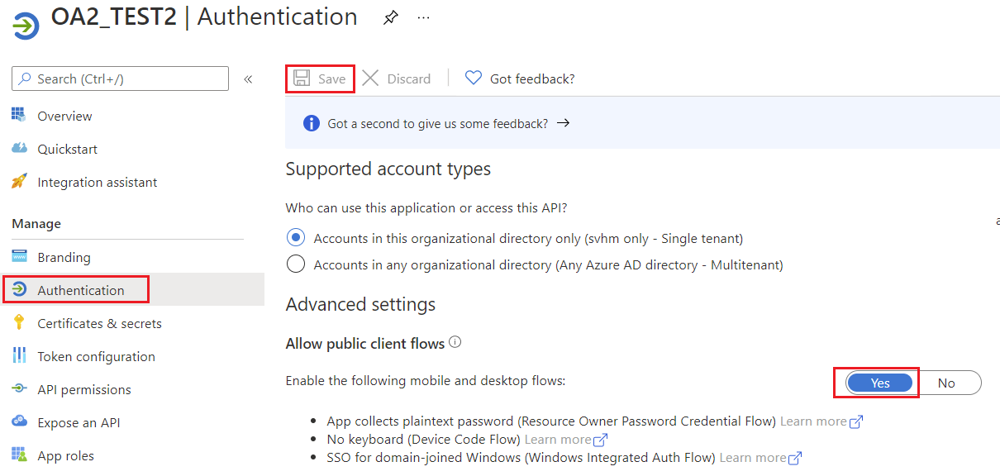
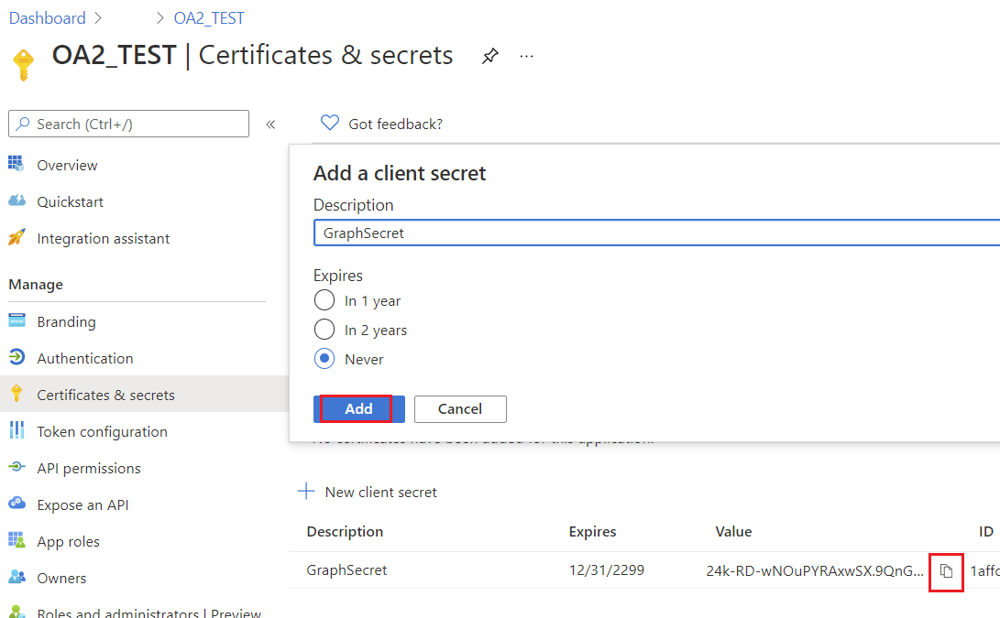

## **Creating Project in Azure Active Directory Admin Center**

A Project is to be created on Azure Active Directory admin center for a user having MS Office account.
### **Steps to Create a Project in Azure Active Directory Admin Center**

Following is a step by step tutorial for creating a project in Azure Active Directory admin center.

#### 1. Go to Azure Active Directory and login using your MS Office credentials.

**Azure Active Directory** Link - <https://aad.portal.azure.com/>

#### 2. Create an Azure AD Application in your tenant.

In the left side pane click the label **Azure Active Directory**. This will open up the blade for Azure Active Directory. In that screen should see a label **App registrations**. This is the starting point of a registering an Azure AD Application. This blade will allow you to create a new application for Azure AD.

Click on the button **New registration** to create a new application.

#### 3. Now you will see the new application registration blade.

- **Name** This will be the name of your application.
- **Supported account types** This section will restrict the access.

Click **Register** button.

#### 4. You should see the newly registered applications blade.

- **Application (client) ID** The id of your application.
- **Directory (tenant) ID** The Azure AD tenant id.

#### 5. Allowing permissions for Microsoft Graph API.

Click on the **API permissions** label.

Azure has already given you **User.Read** delegated permissions for your application. This permission will allow us to read user information for a logged in user. These are Microsoft Graph API permissions, in other hand we can call them as **Scopes**.

The full list of scopes for Microsoft Graph API - <https://docs.microsoft.com/en-us/graph/permissions-reference>.

Click on **+ Add a permission** button and select **Microsoft Graph**.

Click on **Delegated permissions**. Now you see a list of permissions available for Microsoft Graph API.

Select required permissions, click **Add permissions** button.

Click **Grant admin consent** button.

#### 6. Allow public client flows.

Specifies whether the application is a public client. Appropriate for apps using token grant flows that don't use a redirect URI.

#### 7. Create a key for the application

## **Helper Classes**

Following helper classes are required to run the codes in this section. These classes are just for simplification of demonstration.

### **AzureROPCTokenProvider Class**

An instance of the [IGraphClient](https://apireference.aspose.com/email/java/com.aspose.email/IGraphClient) class handles building requests, sending them to the Microsoft Graph API, and processing the responses. To create a new instance of this  class, you need to provide an instance of [ITokenProvider](https://apireference.aspose.com/email/java/com.aspose.email/ITokenProvider), which can authenticate requests to Microsoft Graph.

~~~Java
import java.io.BufferedReader;
import java.io.IOException;
import java.io.InputStream;
import java.io.InputStreamReader;
import java.io.OutputStream;
import java.io.UnsupportedEncodingException;
import java.net.HttpURLConnection;
import java.net.URL;
import java.net.URLDecoder;
import java.net.URLEncoder;
import java.nio.charset.StandardCharsets;
import java.util.HashMap;
import java.util.Map;

/**
 * 

 * Azure resource owner password credential (ROPC) token provider https://docs.microsoft.com/en-us/azure/active-directory/develop/v2-oauth-ropc
 * https://docs.microsoft.com/en-us/exchange/client-developer/exchange-web-services/how-to-authenticate-an-ews-application-by-using-oauth https://portal.azure.com
 * https://developer.microsoft.com/en-us/graph/graph-explorer/# token parser https://jwt.io
 * 

 */
class AzureROPCTokenProvider implements ITokenProvider {

    private static final String GRANT_TYPE = "password";

    private final String clientId;
    private final String clientSecret;
    private final String userName;
    private final String password;
    private final String tenant;
    private final String scope;

    private OAuthToken token;

    public AzureROPCTokenProvider(String tenant, String clientId, String clientSecret, String userName, String password, String[] scopeAr) {
        this.tenant = tenant;
        this.clientId = clientId;
        this.clientSecret = clientSecret;
        this.userName = userName;
        this.password = password;
        this.scope = strJoin(scopeAr, " ");
    }

    public synchronized OAuthToken getAccessToken(boolean ignoreExistingToken) {
        if (this.token != null && !this.token.getExpired() && !ignoreExistingToken)
            return this.token;
        token = null;

        Map<String, String> tokenArgs = geToken();

        java.util.Calendar c = java.util.Calendar.getInstance();
        c.add(java.util.Calendar.SECOND, Integer.parseInt(tokenArgs.get("expires_in")));
        token = new OAuthToken(tokenArgs.get("access_token"), TokenType.AccessToken, c.getTime());
        return token;
    }

    public final OAuthToken getAccessToken() {
        return getAccessToken(false);
    }

    public void dispose() {
    }

    private String getEncodedParameters() {
        return "client_id=" + urlEncode(clientId) + "&scope=" + urlEncode(scope) + "&username=" + urlEncode(userName) + "&password=" + urlEncode(password) + "&grant_type="
                + urlEncode(GRANT_TYPE);
    }

    private String getUri() {
        if (tenant == null || tenant.trim().isEmpty())
            return "https://login.microsoftonline.com/common/oauth2/v2.0/token";
        else
            return "https://login.microsoftonline.com/" + tenant + "/oauth2/v2.0/token";
    }

    private Map<String, String> geToken() {
        try {
            HttpURLConnection connection = (HttpURLConnection) new URL(getUri()).openConnection();
            connection.setRequestMethod("POST");

            byte[] requestData = getEncodedParameters().getBytes(StandardCharsets.UTF_8);

            connection.setUseCaches(false);
            connection.setDoInput(true);
            connection.setDoOutput(true);
            connection.setRequestProperty("Content-Type", "application/x-www-form-urlencoded");
            connection.setRequestProperty("Content-Length", "" + requestData.length);

            final OutputStream st = connection.getOutputStream();
            try {
                st.write(requestData, 0, requestData.length);
            } finally {
                st.flush();
                st.close();
            }

            connection.connect();

            if (connection.getResponseCode() >= HttpURLConnection.HTTP_BAD_REQUEST) {
                throw new IllegalAccessError("Operation failed: " + connection.getResponseCode() + "/" + connection.getResponseMessage() + "\r\nDetails:\r\n{2}"
                        + readInputStream(connection.getErrorStream()));
            }

            String responseText = readInputStream(connection.getInputStream());

            Map<String, String> result = new HashMap<String, String>();
            System.out.println(responseText);
            String[] strs = responseText.replace("{", "").replace("}", "").replace("\"", "").replace("\r", "").replace("\n", "").split(",");
            for (String sPair : strs) {
                String[] pair = sPair.split(":");
                String name = pair[0].trim().toLowerCase();
                String value = urlDecode(pair[1].trim());
                result.put(name, value);
            }

            return result;
        } catch (IOException e) {
            throw new IllegalAccessError(e.getMessage());
        }
    }

    static String urlEncode(String value) {
        try {
            return URLEncoder.encode(value, StandardCharsets.UTF_8.toString());
        } catch (UnsupportedEncodingException e) {
            throw new IllegalAccessError(e.getMessage());
        }
    }

    static String urlDecode(String value) {
        try {
            return URLDecoder.decode(value, StandardCharsets.UTF_8.toString());
        } catch (UnsupportedEncodingException e) {
            throw new IllegalAccessError(e.getMessage());
        }
    }

    static String readInputStream(InputStream is) {
        if (is == null)
            return "";

        BufferedReader reader = new BufferedReader(new InputStreamReader(is));
        StringBuilder result = new StringBuilder();
        String line;
        try {
            while ((line = reader.readLine()) != null) {
                result.append(line);
            }
        } catch (IOException e) {
            // ignore
        }
        return result.toString();
    }

    static String strJoin(String[] arr, String sep) {
        StringBuilder sb = new StringBuilder();
        for (int i = 0; i < arr.length; i++) {
            if (i > 0)
                sb.append(sep);
            sb.append(arr[i]);
        }
        return sb.toString();
    }
}
~~~
