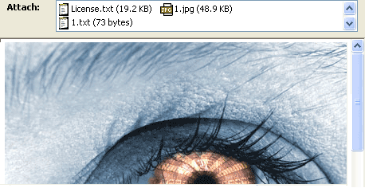
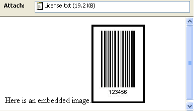
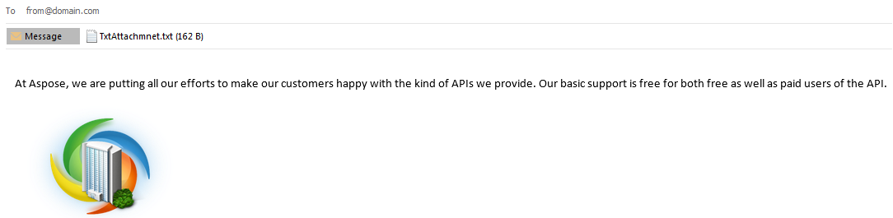

## **Managing Email Attachments**
An email attachment is a file that is sent along with an email message. The file may be sent as a separate message as well as a part of the message to which it is attached. The [Attachment](https://apireference.aspose.com/java/email/com.aspose.email/attachment) class is used with the [MailMessage](https://apireference.aspose.com/java/email/com.aspose.email/mailmessage) class. All messages include a body. In addition to the body, you might want to send additional files. These are sent as attachments and are represented as an instance of the [Attachment](https://apireference.aspose.com/java/email/com.aspose.email/attachment) class. You can send any number of attachments but the size of the attachment is limited by the mail server. Gmail, for example, does not support file sizes greater than 10MB.

### **Adding Attachment**
To attach an attachment to an email, please follow these steps:

1. Create an instance of the [MailMessage](https://apireference.aspose.com/java/email/com.aspose.email/mailmessage) class.
1. Create an instance of the [Attachment](https://apireference.aspose.com/java/email/com.aspose.email/attachment) class.
1. Load attachment into the [Attachment](https://apireference.aspose.com/java/email/com.aspose.email/attachment) instance.
1. Add the [Attachment](https://apireference.aspose.com/java/email/com.aspose.email/attachment) instance into the [MailMessage](https://apireference.aspose.com/java/email/com.aspose.email/mailmessage) instance.

The following code snippet shows you how to add an attachment to an email.

~~~Java
// The path to the File directory.
String dataDir = "data/";

// Create an instance of MailMessage class
MailMessage message = new MailMessage();
message.setFrom(new MailAddress("sender@sender.com"));
message.getTo().add("receiver@gmail.com");

// Load an attachment
Attachment attachment = new Attachment(dataDir + "1.txt");

// Add Multiple Attachment in instance of MailMessage class and Save message to disk
message.getAttachments().addItem(attachment);
message.addAttachment(new Attachment(dataDir + "1.jpg"));
message.addAttachment(new Attachment(dataDir + "1.doc"));
message.addAttachment(new Attachment(dataDir + "1.rar"));
message.addAttachment(new Attachment(dataDir + "1.pdf"));
message.save(dataDir + "outputAttachments_out.msg", SaveOptions.getDefaultMsgUnicode());
~~~

Above, we described how to add attachments to your email message with Aspose.Email. What follows shows how to remove attachments, and display information about them on screen.
### **Removing an Attachment**
To remove an attachment, follow the steps given below:

- Create an instance of [Attachment](https://apireference.aspose.com/java/email/com.aspose.email/attachment) class.
- Load attachment in the instance of [Attachment](https://apireference.aspose.com/java/email/com.aspose.email/attachment) class.
- Add the attachment to the instance of [MailMessage](https://apireference.aspose.com/java/email/com.aspose.email/mailmessage) class.
- Remove the attachments from the instance of [Attachment](https://apireference.aspose.com/java/email/com.aspose.email/attachment) class using the [MailMessage](https://apireference.aspose.com/java/email/com.aspose.email/mailmessage) class instance.

The following code snippet shows you how to remove an attachment.

~~~Java
// Load attachment to your Mail Message, Add attachment and Remove attachment from your MailMessage
Attachment attachment = new Attachment("1.txt");
message.getAttachments().addItem(attachment);
message.getAttachments().removeItem(attachment);
~~~
### **Displaying Attachment File Name**
To display the attachment file name, follow these steps:

1. Loop through the attachments in the email message and
   1. Save each attachment.
   1. Display each attachment's name on the screen.

The following code snippet shows you how to display an attachment file name on the screen.

~~~Java
// Create a loop to display the no. of attachments present in email message
for (Attachment attachment : message.getAttachments()) {
    // Display the the attachment file name
    System.out.println(attachment.getName());
}
~~~
### **Extracting Email Attachments**
This topic explains how to extract an attachment from an email file. An email attachment is a file that is sent along with an email message. The file may be sent as a separate message as well as a part of the message to which it is attached. All email messages include an option to send additional files. These are sent as attachments and are represented as instances of the [Attachment](https://apireference.aspose.com/java/email/com.aspose.email/attachment) class. The [Attachment](https://apireference.aspose.com/java/email/com.aspose.email/attachment) class is used with the [MailMessage](https://apireference.aspose.com/java/email/com.aspose.email/mailmessage) class to work with attachments. To extract attachments from an email message, follow these steps:

- Create an instance of the [MailMessage](https://apireference.aspose.com/java/email/com.aspose.email/mailmessage) class.
- Load an email file into the [MailMessage](https://apireference.aspose.com/java/email/com.aspose.email/mailmessage) instance.
- Create an instance of the [Attachment](https://apireference.aspose.com/java/email/com.aspose.email/attachment) class and use it in a loop to extract all attachments.
- Save the attachment and display it on screen.

|**Extracted attachments in email**|
| :- |
||
The following code snippet shows you how to Extract Email Attachments.

~~~Java
// The path to the File directory.
String dataDir = "data/";

// Create an instance of MailMessage and load an email file
MailMessage mailMsg = MailMessage.load(dataDir + "Message.msg", new MsgLoadOptions());

for (Attachment attachment : mailMsg.getAttachments()) {
    // To display the the attachment file name
    attachment.save(dataDir + "MessageEmbedded_out.msg");

    System.out.println(attachment.getName());
}
~~~
#### **Retrieving Content-Description from Attachment**
Aspose.Email API provides the capability to read attachment's Content-Description from attachment header. The following code snippet shows you how to retrieve the content description from the attachment.

~~~Java
MailMessage message = MailMessage.load(fileName);
String description = message.getAttachments().get_Item(0).getHeaders().get_Item("Content-Description");
~~~
#### **Determining if Attachment is Embedded Message**
The following code snippet demonstrates how to determine if the attachment is an embedded message or not.

~~~Java
MailMessage eml = MailMessage.load(fileName);

if (eml.getAttachments().get_Item(0).isEmbeddedMessage())
    System.out.println("Attachment is an embedded message.");
else
    System.out.println("Attachment is not an embedded message.");
~~~
## **Working with Embedded Objects**
An embedded object is an object that was created with one application and enclosed within a document or file created by another application. For example, a Microsoft Excel spreadsheet can be embedded into a Microsoft Word report, or a video file can be embedded into a Microsoft PowerPoint presentation. When a file is embedded, rather than inserted or pasted into another document, it retains its original format. The embedded document can be opened in the original application and modified.
### **Embedding Objects into an Email**
The [LinkedResource](https://apireference.aspose.com/java/email/com.aspose.email/linkedresource) class is used with the [MailMessage](https://apireference.aspose.com/java/email/com.aspose.email/mailmessage) class to embed objects in your email messages. To add an embedded object, follow these steps

1. Create an instance of the [MailMessage](https://apireference.aspose.com/java/email/com.aspose.email/mailmessage) class.
1. Specify the from, to and subject values in [MailMessage](https://apireference.aspose.com/java/email/com.aspose.email/mailmessage) instance.
1. Create an instance of the [AlternateView](https://apireference.aspose.com/email/java/com.aspose.email/alternateview) class.
1. Create an instance of the [LinkedResource](https://apireference.aspose.com/java/email/com.aspose.email/linkedresource) class.
1. Load an embedded object into the [LinkedResourceCollection](https://apireference.aspose.com/email/java/com.aspose.email/linkedresourcecollection).
1. Add the loaded embedded object into the [MailMessage](https://apireference.aspose.com/java/email/com.aspose.email/mailmessage) class instance.
1. Add the [AlternateView](https://apireference.aspose.com/email/java/com.aspose.email/alternateview) instance to the [MailMessage](https://apireference.aspose.com/java/email/com.aspose.email/mailmessage) class instance.

The code snippets below produce an email message with both plain text and HTML bodies and an image embedded into the HTML

|**Image embedded into email**|
| :- |
||
You can send any number of embedded objects. The size of the attachment is limited by the mail server. Gmail, for example, does not support file sizes greater than 10MB. The code snippets below demonstrate how to embed objects into an Email.

~~~Java
// The path to the File directory.
String dataDir = "data/";
String dstEmail = dataDir + "EmbeddedImage.msg";

// Create an instance of the MailMessage class and Set the addresses and Set the content
MailMessage mail = new MailMessage();
mail.setFrom(new MailAddress("test001@gmail.com"));
mail.getTo().add("test001@gmail.com");
mail.setSubject("This is an email");

// Create the plain text part It is viewable by those clients that don't support HTML
AlternateView plainView = AlternateView.createAlternateViewFromString("This is my plain text content", null, "text/plain");

/*
 * Create the HTML part.To embed images, we need to use the prefix 'cid' in the img src value. The cid value will map to the Content-Id of a Linked resource. Thus  will map to a LinkedResource with a ContentId of //'barcode'.
 */
AlternateView htmlView = AlternateView.createAlternateViewFromString("Here is an embedded image.", null, "text/html");

// Create the LinkedResource (embedded image) and Add the LinkedResource to the appropriate view
LinkedResource barcode = new LinkedResource(dataDir + "1.jpg", MediaTypeNames.Image.JPEG);
barcode.setContentId("barcode");

mail.getLinkedResources().addItem(barcode);
mail.getAlternateViews().addItem(plainView);
mail.getAlternateViews().addItem(htmlView);
mail.save(dataDir + "EmbeddedImage_out.msg", SaveOptions.getDefaultMsgUnicode());
~~~
### **Removing Embedded Objects from Email**
[LinkedResourceCollection](https://apireference.aspose.com/email/java/com.aspose.email/linkedresourcecollection) accessed via [MailMessage.LinkedResources](https://apireference.aspose.com/email/java/com.aspose.email/MailMessage#getLinkedResources\(\)) property. The [LinkedResourceCollection](https://apireference.aspose.com/email/java/com.aspose.email/linkedresourcecollection) collection provides a method to completely remove embedded objects added into an email message. Use the overloaded version of [LinkedResourceCollection.removeAt](https://apireference.aspose.com/email/java/com.aspose.email/LinkedResourceCollection#removeAt\(int,%20boolean\)) method to remove all traces of an embedded object from an email message.

The sample code below shows how to remove embedded objects from an email message.

~~~Java
String dataDir = "data/";

// sample input file
String fileName = "EmlWithLinkedResources.eml";

// Load the test message with Linked Resources
MailMessage msg = MailMessage.load(dataDir + fileName);

// Remove a LinkedResource
msg.getLinkedResources().removeAt(0, true);

// Now clear the Alternate View for linked Resources
msg.getAlternateViews().get_Item(0).getLinkedResources().clear(true);
~~~
### **Extracting Embedded Objects**
This topic explains how to extract embedded objects from an email file. An embedded object is an object that was created with one application and enclosed within a document or file created by another application. For example, a Microsoft Excel spreadsheet can be embedded into a Microsoft Word report, or a video file can be embedded into a Microsoft PowerPoint presentation. When a file is embedded, rather than inserted or pasted into another document, it retains its original format. The embedded document can be opened in the original application and be modified. To extract an embedded object from an email message, follow these steps:

1. Create an instance of the [MailMessage](https://apireference.aspose.com/java/email/com.aspose.email/mailmessage) class.
1. Load an email file in the [MailMessage](https://apireference.aspose.com/java/email/com.aspose.email/mailmessage) instance.
1. Create a loop and create an instance of the [Attachment](https://apireference.aspose.com/java/email/com.aspose.email/attachment) class in it.
1. Save the attachment and display it on screen.
1. Specify the sender and recipient address in the [MailMessage](https://apireference.aspose.com/java/email/com.aspose.email/mailmessage) instance.
1. Send email using the [SmtpClient](https://apireference.aspose.com/email/java/com.aspose.email/smtpclient) class.

The code snippet below extracts embedded objects from an email.

|**Extracted embedded objects in email**|
| :- |
||
The following code snippet shows you how to Extracting Embedded Objects.

~~~Java
// The path to the File directory.
String dataDir = "data/";

// Create an instance of MailMessage and load an email file
MailMessage mailMsg = MailMessage.load(dataDir + "Message.msg", new MsgLoadOptions());

for (Attachment attachment : mailMsg.getAttachments()) {
    // To display the the attachment file name
    attachment.save(dataDir + "MessageEmbedded_out.msg");

    System.out.println(attachment.getName());
}
~~~
#### **Identify and Extract embedded attachment from MSG formatted as RTF**
For messages formatted as RTF, the following code can be used to differentiate and extract attachments that are either Inline or appear as Icon in the message body. The following code snippet shows you how to Identify and Extract embedded attachment from MSG formatted as RTF.

~~~Java
public static void extractInlineAttachments(String dataDir) {
    MapiMessage message = MapiMessage.fromFile(dataDir + "MSG file with RTF Formatting.msg");
    MapiAttachmentCollection attachments = message.getAttachments();
    for (MapiAttachment attachment : attachments) {

        if (isAttachmentInline(attachment)) {
            try {
                saveAttachment(attachment, UUID.randomUUID().toString());
            } catch (Exception ex) {
                System.err.println(ex);
            }
        }
    }
}

static boolean isAttachmentInline(MapiAttachment attachment) {
    for (MapiProperty property : attachment.getObjectData().getProperties().get_Values()) {
        if ("\u0003ObjInfo".equals(property.getName())) {
            byte[] data = property.getData();
            int odtPersist1 = data[1] << 8 | data[0];
            return (odtPersist1 & 0x40) == 0;
        }
    }
    return false;
}

static void saveAttachment(MapiAttachment attachment, String fileName) throws IOException {
    for (MapiProperty property : attachment.getObjectData().getProperties().get_Values()) {
        if ("Package".equals(property.getName())) {
            try (FileOutputStream fs = new FileOutputStream(fileName)) {
                fs.write(property.getData(), 0, property.getData().length);
            }
        }
    }
}
~~~

### **Working with Content-Type and Content-Disposition**
Aspose.Email API provides the capability to working with attachment's [Content-Type](https://tools.ietf.org/html/rfc2045#section-5) and [Content-Disposition](https://tools.ietf.org/html/rfc2183) from attachment header. The following code snippet shows you how to get and change the content description from the attachment.

#### **Displaying Content-Type and Content-Disposition parameters**
The following code snippet shows you how to display an parameters of Content-Type and Content-Disposition on the screen:

~~~Java
void run(MailMessage message) {
    // Attachments
    for (Attachment attachment : message.getAttachments()) {
        ContentDisposition contentDisposition = attachment.getContentDisposition();
        printContentDisposition(contentDisposition);
        ContentType contentType = attachment.getContentType();
        printContentType(contentType);
    }
    // Linked Resources
    for (LinkedResource attachment : message.getLinkedResources()) {
        ContentDisposition contentDisposition = attachment.getContentDisposition();
        printContentDisposition(contentDisposition);
        ContentType contentType = attachment.getContentType();
        printContentType(contentType);
    }
}

void printContentType(ContentType contentType) {
    System.out.println("media-type: " + contentType.getMediaType());
    System.out.println("charset: " + contentType.getCharSet());
    System.out.println("name: " + contentType.getName());
}

void printContentDisposition(ContentDisposition contentDisposition) {
    System.out.println("disposition-type: " + contentDisposition.getDispositionType());
    System.out.println("is-inline: " + contentDisposition.getInline());
    System.out.println("filename: " + contentDisposition.getFileName());
    System.out.println("creation-date: " + contentDisposition.getCreationDate());
    System.out.println("modification-date: " + contentDisposition.getModificationDate());
    System.out.println("read-date: " + contentDisposition.getReadDate());
    System.out.println("size: " + contentDisposition.getSize());
}
~~~
#### **Using Content-Type and Content-Disposition parameters with Attachments**
The following code snippet shows you how to use the Content-Type and Content-Disposition parameters  with Attachment:

~~~Java
MailMessage eml = MailMessage.load(fileName);

Attachment attachment = new Attachment(pdfFileName, new ContentType("application/octet-stream"));
attachment.getContentDisposition().setDispositionType("attachment");
attachment.getContentDisposition().setFileName(fileName);

eml.addAttachment(attachment);
~~~