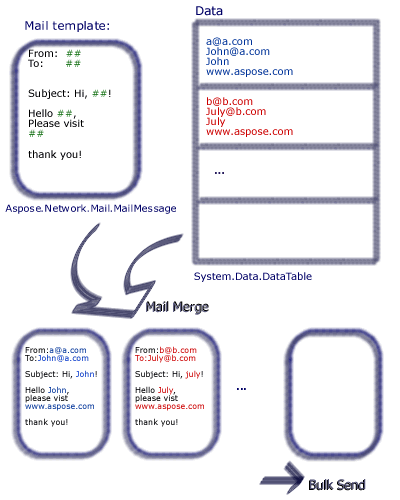

The [SmtpClient](https://apireference.aspose.com/email/java/com.aspose.email/SmtpClient) class allows applications to send email using the Simple Mail Transfer Protocol (SMTP).

- The [SmtpClient](https://apireference.aspose.com/email/java/com.aspose.email/SmtpClient) class is the only major entry developers use to send mail messages.
- The [SmtpClient](https://apireference.aspose.com/email/java/com.aspose.email/SmtpClient) class also provides other common email delivery methods, including writing email messages to the file system, message queue etc.
- The [SmtpClient](https://apireference.aspose.com/email/java/com.aspose.email/SmtpClient) class fully supports these two programming models:
  - [Synchronous](#sending-emails-synchronously)
  - [Asynchronous](#sending-emails-asynchronously)
- The [SmtpClient](https://apireference.aspose.com/email/java/com.aspose.email/SmtpClient) class also supports [sending messages as TNEF](#sending-message-as-tnef)

To send the email message and block while waiting for the email to be transmitted to the SMTP server, use one of the synchronous Send methods. To allow your program's main thread to continue executing while the email is transmitted, use the [beginSend](https://apireference.aspose.com/email/java/com.aspose.email/SmtpClient#beginSend\(com.aspose.email.MailMessage\)) method.
## **Sending Emails Synchronously**
An email message can be sent synchronously using the [SmtpClient](https://apireference.aspose.com/email/java/com.aspose.email/SmtpClient) class [send](https://apireference.aspose.com/email/java/com.aspose.email/SmtpClient#send\(com.aspose.email.MailMessage\)) method. It sends the specified email message through an SMTP server for delivery. The message sender, recipients, subject, and message body are specified using String objects. To send an email message synchronously, follow the steps given below:

1. Create an instance of [MailMessage](https://apireference.aspose.com/email/java/com.aspose.email/MailMessage) class and set its properties.
1. Create an instance of [SmtpClient](https://apireference.aspose.com/email/java/com.aspose.email/SmtpClient) class and specify the Host, port, username & Password.
1. Send the Message using the [SmtpClient](https://apireference.aspose.com/email/java/com.aspose.email/SmtpClient) class [send](https://apireference.aspose.com/email/java/com.aspose.email/SmtpClient#send\(com.aspose.email.MailMessage\)) method and pass the [MailMessage](https://apireference.aspose.com/email/java/com.aspose.email/MailMessage) instance.

The following code snippet shows you how to send emails synchronously.

~~~Java
// For complete examples and data files, please go to https://github.com/aspose-email/Aspose.Email-for-Java

// Declare msg as MailMessage instance
MailMessage msg = new MailMessage();

// Create an instance of SmtpClient class
SmtpClient client = new SmtpClient();

// Specify your mailing host server, Username, Password, Port # and Security option
client.setHost("mail.server.com");
client.setUsername("username");
client.setPassword("password");
client.setPort(587);
client.setSecurityOptions(SecurityOptions.SSLExplicit);

try {
    // Client.Send will send this message
    client.send(msg);
    System.out.println("Message sent");
} catch (Exception ex) {
    System.err.println(ex);
}
~~~
## **Sending Emails Asynchronously**
Sometimes, you may want to send mail asynchronously. For example, if you are sending a lot of mail through your application, the synchronous approach might not work. In such a scenario, you can use [beginSend](https://apireference.aspose.com/email/java/com.aspose.email/SmtpClient#beginSend\(com.aspose.email.MailMessage\)). The [beginSend](https://apireference.aspose.com/email/java/com.aspose.email/SmtpClient#beginSend\(com.aspose.email.MailMessage\)) method of the [SmtpClient](https://apireference.aspose.com/email/java/com.aspose.email/SmtpClient) class sends an email message to an SMTP server for delivery. This method does not block the calling thread and allows the caller to pass an object to the method that is invoked when the operation completes. To send an email message asynchronously, follow these steps:

1. Create an instance of [MailMessage](https://apireference.aspose.com/email/java/com.aspose.email/MailMessage) class and use its different properties.
1. Create an instance of [SmtpClient](https://apireference.aspose.com/email/java/com.aspose.email/SmtpClient) class and specify the host, port, username, and password.
1. Create a user-defined instance that will be passed to the method and invoked when the asynchronous operation completes.
1. Send the message using [beginSend](https://apireference.aspose.com/email/java/com.aspose.email/SmtpClient#beginSend\(com.aspose.email.MailMessage\)) method of [SmtpClient](https://apireference.aspose.com/email/java/com.aspose.email/SmtpClient) class and pass the [MailMessage](https://apireference.aspose.com/email/java/com.aspose.email/MailMessage) instance and user-defined instance in it along with a callback function to be called when the operation is completed.

To receive a notification when the email has been sent or the operation has been canceled, the callback function passed to the [beginSend](https://apireference.aspose.com/email/java/com.aspose.email/SmtpClient#beginSend\(com.aspose.email.MailMessage\)) method is called. After calling the [SmtpClient](https://apireference.aspose.com/email/java/com.aspose.email/SmtpClient) class [beginSend](https://apireference.aspose.com/email/java/com.aspose.email/SmtpClient#beginSend\(com.aspose.email.MailMessage\)) method it is not necessary to wait for an email message to be sent completely. We can call another method [beginSend](https://apireference.aspose.com/email/java/com.aspose.email/SmtpClient#beginSend\(com.aspose.email.MailMessage\)) at the same time. When an email has been sent using the [beginSend](https://apireference.aspose.com/email/java/com.aspose.email/SmtpClient#beginSend\(com.aspose.email.MailMessage\)) method, the code snippet prints a message ("Message Sent"). The following code snippet shows you how to send emails asynchronously.

~~~Java
// For complete examples and data files, please go to https://github.com/aspose-email/Aspose.Email-for-Java

public static void run() {
    sendMail();
}

static SmtpClient getSmtpClient() {
    SmtpClient client = new SmtpClient();
    client.setHost("mail.server.com");
    // Specify your mail Username, Password, Port # and security option
    client.setUsername("username");
    client.setPassword("password");
    client.setPort(587);
    client.setSecurityOptions(SecurityOptions.SSLExplicit);
    return client;
}

static void sendMail() {
    try {

        // Declare msg as MailMessage instance
        MailMessage msg = new MailMessage("sender@gmail.com", "receiver@gmail.com", "Test subject", "Test body");
        SmtpClient client = getSmtpClient();
        Object state = new Object();
        IAsyncResult ar = client.beginSend(msg, callback, state);
        // If the user canceled the send, and mail hasn't been sent yet,
        client.cancelAsyncOperation(ar);

        msg.dispose();
        System.out.println("Goodbye.");
    } catch (Exception ex) {
        System.err.println(ex);
    }
}

static AsyncCallback callback = new AsyncCallback() {
    public void invoke(IAsyncResult ar) {
        IAsyncResultExt task = null;
        if (ar instanceof IAsyncResult)
            task = (IAsyncResultExt) ar;

        if (task != null && task.isCanceled()) {
            System.out.println("Send canceled.");
        }

        if (task != null && task.getErrorInfo() != null) {
            System.out.println(task.getErrorInfo());
        } else {
            System.out.println("Message Sent.");
        }
    }
};
~~~
## **Sending Stored Messages from Disc**
EML files, (Outlook Express Electronic Mail files) contains an email's header, message body, and any attachments. Aspose.Email lets developers work with EML files in different ways. This article shows how to load EML files from disk and send them as emails with SMTP. You can load .eml files from disk or stream into the [MailMessage](https://apireference.aspose.com/email/java/com.aspose.email/MailMessage) class and send the email message using the [SmtpClient](https://apireference.aspose.com/email/java/com.aspose.email/SmtpClient) class. The [MailMessage](https://apireference.aspose.com/email/java/com.aspose.email/MailMessage) class is the main class for creating new email messages, loading email message files from disk or stream and saving the messages. The following code snippet shows how to sending stored messages from the disc.

~~~Java
// For complete examples and data files, please go to https://github.com/aspose-email/Aspose.Email-for-Java

// Load an EML file in MailMessage class
MailMessage message = MailMessage.load(dataDir + "test.eml");

// Send this message using SmtpClient
SmtpClient client = new SmtpClient("host", "username", "password");

try {
    client.send(message);
} catch (Exception ex) {
    System.out.println(ex.getMessage());
}
~~~
## **Sending Plain Text Email**
The programming samples below show how to send a plain text email message. The [Body](https://apireference.aspose.com/email/java/com.aspose.email/MailMessage#getBody\(\)) property, a property of the [MailMessage](https://apireference.aspose.com/email/java/com.aspose.email/MailMessage) class, is used to specify the plain text content of the message body. To send a plain text email message, follow these steps:

- Create an instance of the [MailMessage](https://apireference.aspose.com/email/java/com.aspose.email/MailMessage) class.
- Specify the sender and receiver email addresses in the [MailMessage](https://apireference.aspose.com/email/java/com.aspose.email/MailMessage) instance.
- Specify the [Body](https://apireference.aspose.com/email/java/com.aspose.email/MailMessage#getBody\(\)) content, used for the plain text message.
- Create an instance of the [SmtpClient](https://apireference.aspose.com/email/java/com.aspose.email/SmtpClient) class and send the email.

The following code snippet shows you how to send a plain text email.

~~~Java
// For complete examples and data files, please go to https://github.com/aspose-email/Aspose.Email-for-Java

// Create an instance of the MailMessage class
MailMessage message = new MailMessage();

// Set From field, To field and Plain text body
message.setFrom(MailAddress.to_MailAddress("sender@sender.com"));
message.getTo().add("receiver@receiver.com");
message.setBody("This is Plain Text Body");

// Create an instance of the SmtpClient class
SmtpClient client = new SmtpClient();

// And Specify your mailing host server, Username, Password and Port
client.setHost("smtp.server.com");
client.setUsername("Username");
client.setPassword("Password");
client.setPort(25);

try {
    // Client.Send will send this message
    client.send(message);
    System.out.println("Message sent");
} catch (Exception ex) {
    System.err.println(ex);
}
~~~
## **Sending Email with HTML body**
The programming samples below show how you can send a simple HTML email message. The [HtmlBody](https://apireference.aspose.com/email/java/com.aspose.email/MailMessage#getHtmlBody\(\)), a property of the [MailMessage](https://apireference.aspose.com/email/java/com.aspose.email/MailMessage) class, is used to specify the HTML content of the message body. To send a simple HTML email, follow these steps:

- Create an instance of the [MailMessage](https://apireference.aspose.com/email/java/com.aspose.email/MailMessage) class.
- Specify sender and receiver email address in the [MailMessage](https://apireference.aspose.com/email/java/com.aspose.email/MailMessage) instance.
- Specify the [HtmlBody](https://apireference.aspose.com/email/java/com.aspose.email/MailMessage#getHtmlBody\(\)) content.
- Create an instance of the [SmtpClient](https://apireference.aspose.com/email/java/com.aspose.email/SmtpClient) class and send the email using the [send](https://apireference.aspose.com/email/java/com.aspose.email/SmtpClient#send\(com.aspose.email.MailMessage\)) method.

For the purposes of this article, the HTML content of the email is rudimentary: <html><body>This is the HTML body</body></html> Most HTML emails will be more complex. The following code snippet shows you how to send an email with HTML body.

~~~Java
public static void run() {
    // Declare msg as MailMessage instance
    MailMessage msg = new MailMessage();

    // Use MailMessage properties like specify sender, recipient, message and HtmlBody
    msg.setFrom(MailAddress.to_MailAddress("newcustomeronnet@gmail.com"));
    msg.setTo(MailAddressCollection.to_MailAddressCollection("asposetest123@gmail.com"));
    msg.setSubject("Test subject");
    msg.setHtmlBody("<html><body>This is the HTML body</body></html>");
    SmtpClient client = getSmtpClient();
    try {
        // Client will send this message
        client.send(msg);
        System.out.println("Message sent");
    } catch (Exception ex) {
        System.err.println(ex);
    }

    System.out.println("Email sent with HTML body.");
}

private static SmtpClient getSmtpClient() {
    SmtpClient client = new SmtpClient("smtp.gmail.com", 587, "your.email@gmail.com", "your.password");
    client.setSecurityOptions(SecurityOptions.Auto);
    return client;
}
~~~
## **Sending Email with Alternate Message Text**
The programming samples below show how to send a simple HTML email message with alternative content. Use the [AlternateView](https://apireference.aspose.com/email/java/com.aspose.email/AlternateView) class to specify copies of an email message in different formats. For example, if you send a message in HTML, you might also want to provide a plain text version for recipients who use email readers that cannot display HTML content. Or, if you are sending a newsletter, you might want to provide a plain text copy of the text for those recipients who have chosen to receive a plain text version. To send an email with alternate text, follow these steps:

1. Create an instance of the [MailMessage](https://apireference.aspose.com/email/java/com.aspose.email/MailMessage) class.
1. Specify sender and receiver email addresses in the [MailMessage](https://apireference.aspose.com/email/java/com.aspose.email/MailMessage) instance.
1. Create an instance of the [AlternateView](https://apireference.aspose.com/email/java/com.aspose.email/AlternateView) class.

This creates an alternate view to an email message using the content specified in the string.

1. Add the instance of the [AlternateView](https://apireference.aspose.com/email/java/com.aspose.email/AlternateView) class to the [MailMessage](https://apireference.aspose.com/email/java/com.aspose.email/MailMessage) object.
1. Create an instance of the [SmtpClient](https://apireference.aspose.com/email/java/com.aspose.email/SmtpClient) class and send the email using the [send](https://apireference.aspose.com/email/java/com.aspose.email/SmtpClient#send\(com.aspose.email.MailMessage\)) method.

The following code snippet shows you how to send an email with alternate text.

~~~Java
// For complete examples and data files, please go to https://github.com/aspose-email/Aspose.Email-for-Java

// Declare message as MailMessage instance
MailMessage message = new MailMessage();

// Creates AlternateView to view an email message using the content specified in the //String
AlternateView alternate = AlternateView.createAlternateViewFromString("Alternate Text");

// Adding alternate text
message.getAlternateViews().addItem(alternate);
~~~
## **Sending Bulk Emails**
Sending emails in bulk means sending a batch of emails in one message. We can send a batch of email using the of [SmtpClient](https://apireference.aspose.com/email/java/com.aspose.email/SmtpClient) class [send](https://apireference.aspose.com/email/java/com.aspose.email/SmtpClient#send\(com.aspose.email.MailMessage\)) method overload that accepts a [MailMessageCollection](https://apireference.aspose.com/email/java/com.aspose.email/MailMessagecollection):

1. Create an instance of [SmtpClient](https://apireference.aspose.com/email/java/com.aspose.email/SmtpClient) class.
1. Specify the [SmtpClient](https://apireference.aspose.com/email/java/com.aspose.email/SmtpClient) class properties.
1. Create an instance of the [MailMessage](https://apireference.aspose.com/email/java/com.aspose.email/MailMessage) class.
1. Specify sender, receiver, mail subject and message in the instance of the [MailMessage](https://apireference.aspose.com/email/java/com.aspose.email/MailMessage) class.
1. Repeat the above two steps again, if you want to send email to a different person.
1. Create an instance of [MailMessageCollection](https://apireference.aspose.com/email/java/com.aspose.email/MailMessagecollection) class.
1. Add an instance of [MailMessage](https://apireference.aspose.com/email/java/com.aspose.email/MailMessage) class in the object of the [MailMessageCollection](https://apireference.aspose.com/email/java/com.aspose.email/MailMessagecollection) class.
1. Now send your email using the [SmtpClient](https://apireference.aspose.com/email/java/com.aspose.email/SmtpClient) class [send](https://apireference.aspose.com/email/java/com.aspose.email/SmtpClient#send\(com.aspose.email.MailMessage\)) method by passing the instance of [MailMessageCollection](https://apireference.aspose.com/email/java/com.aspose.email/MailMessagecollection) class in it.

The following code snippet shows you how to send bulk emails.

~~~Java
// For complete examples and data files, please go to https://github.com/aspose-email/Aspose.Email-for-Java

// Create SmtpClient as client and specify server, port, user name and password
SmtpClient client = new SmtpClient("mail.server.com", 25, "Username", "Password");

// Create instances of MailMessage class and Specify To, From, Subject and Message
MailMessage message1 = new MailMessage("msg1@from.com", "msg1@to.com", "Subject1", "message1, how are you?");
MailMessage message2 = new MailMessage("msg1@from.com", "msg2@to.com", "Subject2", "message2, how are you?");
MailMessage message3 = new MailMessage("msg1@from.com", "msg3@to.com", "Subject3", "message3, how are you?");

// Create an instance of MailMessageCollection class
MailMessageCollection manyMsg = new MailMessageCollection();
manyMsg.addItem(message1);
manyMsg.addItem(message2);
manyMsg.addItem(message3);

// Use client.BulkSend function to complete the bulk send task
try {
    // Send Message using BulkSend method
    client.send(manyMsg);
    System.out.println("Message sent");
} catch (Exception ex) {
    System.err.println(ex);
}
~~~
## **Sending Emails with MultiConnection**
[SmtpClient](https://apireference.aspose.com/email/java/com.aspose.email/SmtpClient) provides a [UseMultiConnection](https://apireference.aspose.com/email/java/com.aspose.email/EmailClient#setUseMultiConnection\(int\)) property which can be used to create multiple connections for heavy operations. You may also set the number of connections to be used during multiconnection mode by using [SmtpClient.ConnectionsQuantity](https://apireference.aspose.com/email/java/com.aspose.email/EmailClient#setConnectionsQuantity\(int\)). The following code snippet demonstrates the use of the multiconnection mode for sending multiple messages.

~~~Java
// For complete examples and data files, please go to https://github.com/aspose-email/Aspose.Email-for-Java

SmtpClient smtpClient = new SmtpClient();
smtpClient.setHost("<HOST>");
smtpClient.setUsername("<USERNAME>");
smtpClient.setPassword("<PASSWORD>");
smtpClient.setPort(587);
smtpClient.setSupportedEncryption(EncryptionProtocols.Tls);
smtpClient.setSecurityOptions(SecurityOptions.SSLExplicit);

List<MailMessage> messages = new ArrayList<MailMessage>();
for (int i = 0; i < 20; i++) {
    MailMessage message = new MailMessage("<EMAIL ADDRESS>", "<EMAIL ADDRESS>", "Test Message - " + UUID.randomUUID().toString(),
            "SMTP Send Messages with MultiConnection");
    messages.add(message);
}

smtpClient.setConnectionsQuantity(5);
smtpClient.setUseMultiConnection(MultiConnectionMode.Enable);
smtpClient.send(messages);
~~~

{} 

Please note that the usage of multiconnection mode does not guarantee performance increase.

{} 
## **Sending Message as TNEF**
TNEF emails have special formatting which may be lost if sent using the standard API. Aspose.Email provides the capability to send emails as TNEF, thus preserving the format. The [SmtpClient](https://apireference.aspose.com/email/java/com.aspose.email/SmtpClient) class [UseTnef](https://apireference.aspose.com/email/java/com.aspose.email/SmtpClient#setUseTnef\(boolean\)) property can be set to send the email as TNEF. The following code snippet shows you how to send a message as TNEF.

~~~Java
// For complete examples and data files, please go to https://github.com/aspose-email/Aspose.Email-for-Java

String emlFileName = dataDir + "Message.eml"; // A TNEF Email

// Load from eml
MailMessage eml1 = MailMessage.load(emlFileName, new EmlLoadOptions());
eml1.setFrom(MailAddress.to_MailAddress("somename@gmail.com"));
eml1.getTo().clear();
eml1.getTo().addItem(new MailAddress("first.last@test.com"));
eml1.setSubject("With PreserveTnef flag during loading");
eml1.setDate(new Date());
SmtpClient client = new SmtpClient("smtp.gmail.com", 587, "somename", "password");
client.setSecurityOptions(SecurityOptions.Auto);
client.setUseTnef(true); // Use this flag to send as TNEF
client.send(eml1);
~~~
## **Sending Meeting Requests**
Microsoft Outlook offers calendar functions as well as email management. When a user opens an email with an invitation to an event, Outlook prompts them to accept or reject the invitation. Aspose.Email lets developers add calendar functions to your emails.
### **Sending Requests via Email**
To send meeting requests via email, follow these steps:

- Create an instance of the [MailMessage](https://apireference.aspose.com/email/java/com.aspose.email/MailMessage) class.
- Specify sender and recipient addresses using an instance of the [MailMessage](https://apireference.aspose.com/email/java/com.aspose.email/MailMessage) class.
- Initialize an instance of the [Appointment](https://apireference.aspose.com/email/java/com.aspose.email/Appointment) class and pass its values.
- Specify summary and description in the [Calendar](https://apireference.aspose.com/email/java/com.aspose.email/Calendar) instance.
- Add the [Calendar](https://apireference.aspose.com/email/java/com.aspose.email/Calendar) to the [MailMessage](https://apireference.aspose.com/email/java/com.aspose.email/MailMessage) instance and pass it the [Appointment](https://apireference.aspose.com/email/java/com.aspose.email/Appointment) instance.

|**iCalendar meeting request sent by email**|
| :- |
||
The following code snippet shows you how to send requests via Email.

~~~Java
// For complete examples and data files, please go to https://github.com/aspose-email/Aspose.Email-for-Java

// Create an instance of the MailMessage class
MailMessage msg = new MailMessage();

// Set the sender, recipient, who will receive the meeting request. Basically, the recipient is the same as the meeting attendees
msg.setFrom(MailAddress.to_MailAddress("newcustomeronnet@gmail.com"));
msg.setTo(MailAddressCollection.to_MailAddressCollection("person1@domain.com, person2@domain.com, person3@domain.com, asposetest123@gmail.com"));

// Create Appointment instance
Calendar cal = Calendar.getInstance();
cal.set(2015, Calendar.JULY, 17, 13, 0, 0);
Date startDate = cal.getTime();
cal.set(2015, Calendar.JULY, 17, 14, 0, 0);
Date endDate = cal.getTime();
Appointment app = new Appointment("Room 112", startDate, endDate, msg.getFrom(), msg.getTo());
app.setSummary("Release Meetting");
app.setDescription("Discuss for the next release");

// Add appointment to the message and Create an instance of SmtpClient class
msg.addAlternateView(app.requestApointment());
SmtpClient client = getSmtpClient();

try {
    // Client.Send will send this message
    client.send(msg);
    System.out.println("Message sent");
} catch (Exception ex) {
    System.err.println(ex);
}
~~~
### **iCalendar supports for IBM Lotus Notes**
Aspose.Email calendar feature is based on the iCalendar standard, a standard for calendar data exchange (RFC 2445 or RFC2445 Syntax Reference). Therefore, it supports not only Microsoft Outlook but also IBM Lotus Notes. To send a meeting request in Lotus Notes, follow the same steps as mentioned above.
## **Forward an Email using SMTP Client**
### **Forwarding Email with SMTP client**
Forwarding an email is common practice in daily life digital communication. An email received can be forwarded to specific recipients without sharing with the original senders. Aspose.Email API's [SmtpClient](https://apireference.aspose.com/email/java/com.aspose.email/SmtpClient) provides the capability to forward an email to specific recipients. Its Forward method can be used to forward a received or saved email to desired recipients as shown in this article. The following code snippet shows you how to Forward an Email using SMTP Client.

~~~Java
// For complete examples and data files, please go to https://github.com/aspose-email/Aspose.Email-for-Java

// Create an instance of SmtpClient class
SmtpClient client = new SmtpClient();

// Specify your mailing host server, Username, Password, Port and SecurityOptions
client.setHost("mail.server.com");
client.setUsername("username");
client.setPassword("password");
client.setPort(587);
client.setSecurityOptions(SecurityOptions.SSLExplicit);
MailMessage message = MailMessage.load(dataDir + "Message.eml");
client.forward("Recipient1@domain.com", "Recipient2@domain.com", message);
~~~
### **Forwarding Email without using MailMessage**
The API also supports forwarding EML messages without first loading into [MailMessage](https://apireference.aspose.com/email/java/com.aspose.email/MailMessage). This is useful in cases where there are limited resources in terms of system memory.

~~~Java
// For complete examples and data files, please go to https://github.com/aspose-email/Aspose.Email-for-Java

String host = "mail.server.com";
String username = "username";
String password = "password";
int smtpPort = 587;
String sender = "Sender@domain.com";
MailAddressCollection recipients = new MailAddressCollection();
recipients.add("recepient1@domain.com, recepient2@domain.com");

try (SmtpClient client = new SmtpClient(host, smtpPort, username, password, SecurityOptions.Auto)) {
    String fileName = "test.eml";
    try (FileInputStream fs = new FileInputStream(new File(dataDir + fileName))) {
        client.forward(sender, recipients, fs);
    }
}
~~~
## **Performing Mail Merge**
Mail merges help you create and send a batch of similar email messages. The core of the emails are the same, but the content can be personalized. Typically, a recipient's contact details (first name, second name, company and so on) are used to personalize the email.

|**Illustration of how a mail merge works:**|
| :- |
||
Aspose.Email lets developers set up mail merges that include data from a variety of data sources.

To perform a mail merge with Aspose.Email, take the following steps:

1. Create a function with the name signature
1. Create an instance of the [MailMessage](https://apireference.aspose.com/email/java/com.aspose.email/MailMessage) class.
1. Specify the sender, receiver, subject, and body.
1. Create a signature for the end of the email.
1. Create an instance of the [TemplateEngine](https://apireference.aspose.com/email/java/com.aspose.email/TemplateEngine) class and pass it the [MailMessage](https://apireference.aspose.com/email/java/com.aspose.email/MailMessage) instance.
1. Take signature in the [TemplateEngine](https://apireference.aspose.com/email/java/com.aspose.email/TemplateEngine) instance.
1. Create an instance of the DataTable class.
1. Add the columns **Receipt**, **FirstName** and **LastName** as data sources in the DataTable class.
1. Create an instance of the DataRow class.
1. Specify the receipt address, first and last names in the DataRow object.
1. Create an instance of the [MailMessageCollection](https://apireference.aspose.com/email/java/com.aspose.email/MailMessagecollection) class
1. Specify the [TemplateEngine](https://apireference.aspose.com/email/java/com.aspose.email/TemplateEngine)  and DataTable instances in the [MailMessageCollection](https://apireference.aspose.com/email/java/com.aspose.email/MailMessagecollection) instance.
1. Create an instance of the [SmtpClient](https://apireference.aspose.com/email/java/com.aspose.email/SmtpClient) class and specify the server, port, username, and password.
1. Send emails using the [SmtpClient](https://apireference.aspose.com/email/java/com.aspose.email/SmtpClient) class [send](https://apireference.aspose.com/email/java/com.aspose.email/SmtpClient#send\(com.aspose.email.MailMessage\)) method.

In the sample below, #FirstName# indicates a column's DataTable, whose value is set by the user. The following code snippet shows you how to perform Mail Merge.

~~~Java
// For complete examples and data files, please go to https://github.com/aspose-email/Aspose.Email-for-Java
public static void run() {
    // The path to the File directory.
    String dstEmail = dataDir + "EmbeddedImage.msg";

    // Create a new MailMessage instance
    MailMessage msg = new MailMessage();

    // Add subject and from address
    msg.setSubject("Hello, #FirstName#");
    msg.setFrom(MailAddress.to_MailAddress("sender@sender.com"));

    // Add email address to send email also Add mesage field to HTML body
    msg.getTo().add("your.email@gmail.com");
    String htmlBody = "Your message here/r/n" + "Thank you for your interest in <STRONG>Aspose.Email</STRONG>.";

    // Use GetSignment as the template routine, which will provide the same signature
    htmlBody += "  Have fun with it.  #GetSignature()#";

    msg.setHtmlBody(htmlBody);

    // Create a new TemplateEngine with the MSG message, Register GetSignature routine. It will be used in MSG.
    TemplateEngine engine = new TemplateEngine(msg);
    engine.registerRoutine("GetSignature", new TemplateRoutine() {
        public Object invoke(Object[] args) {
            return getSignature(args);
        }
    });

    // Create an instance of DataTable and Fill a DataTable as data source
    DataTable dt = new DataTable();
    dt.getColumns().add("Receipt");
    dt.getColumns().add("FirstName");
    dt.getColumns().add("LastName");

    DataRow dr;
    dr = dt.newRow();
    dr.set("Receipt", "Nancy&lt;Nancy@somedomain.com&gt;");
    dr.set("FirstName", "Nancy");
    dr.set("LastName", "Doe");
    dt.getRows().add(dr);
    dr = dt.newRow();
    dr.set("Receipt", "Andrew&lt;Andrew@somedomain.com&gt;");
    dr.set("FirstName", "Andrew");
    dr.set("LastName", "Doe");
    dt.getRows().add(dr);
    dr = dt.newRow();
    dr.set("Receipt", "Janet&lt;Janet@somedomain.com&gt;");
    dr.set("FirstName", "Janet");
    dr.set("LastName", "Doe");
    dt.getRows().add(dr);

    MailMessageCollection messages;
    try {
        // Create messages from the message and datasource.
        messages = engine.instantiate(dt);

        // Create an instance of SmtpClient and specify server, port, username and password
        SmtpClient client = new SmtpClient("smtp.gmail.com", 587, "your.email@gmail.com", "your.password");
        client.setSecurityOptions(SecurityOptions.Auto);

        // Send messages in bulk
        client.send(messages);
    } catch (MailException ex) {
        System.err.println(ex);
    }

    catch (SmtpException ex) {
        System.err.println(ex);
    }

    System.out.println("Message sent after performing mail merge.");
}

// Template routine to provide signature
static Object getSignature(Object[] args) {
    return "Aspose.Email Team Aspose Ltd. " + new Date().toString();
}
~~~
## **Performing Row-Wise Mail Merge**
User can merge individual data row as well to get a complete and prepared [MailMessage](https://apireference.aspose.com/email/java/com.aspose.email/MailMessage) object. The [TemplateEngine.merge](https://apireference.aspose.com/email/java/com.aspose.email/TemplateEngine#merge\(com.aspose.email.MailMessage\)) method can be used to perform a row-wise mail merge.

~~~Java
// Create message from the data in current row.
MailMessage message = engine.merge(currentRow);
~~~
