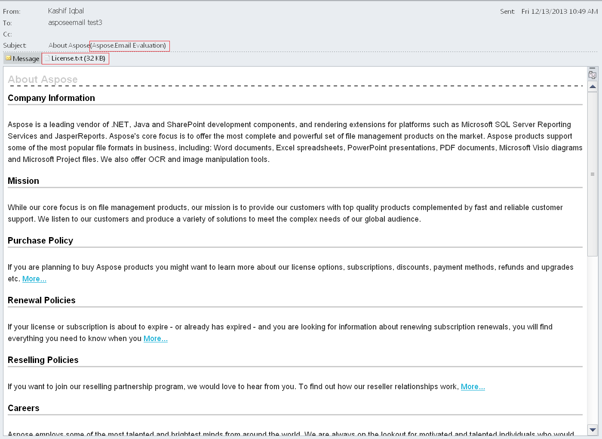

{} 

You can download Aspose.Email for Java free for evaluation. The evaluation version provides almost all functionality of the product with certain limitations. The same evaluation version becomes licensed when you purchase a license and add a couple of lines of code to [apply the license](/email/java/licensing/).

If you want to test Aspose.Email without evaluation version limitations, request a 30 day temporary license. Please refer to [How to get a Temporary License?](http://www.aspose.com/corporate/purchase/temporary-license.aspx)

{} 
## **Evaluation Version Limitations**
Evaluation version of Aspose.Email (without a license specified) provides full product functionality except that a few components - Aspose.Email.Mail, Aspose.Email.Pop3, Aspose.Email.Ftp and Aspose.Email.Imap contain evaluation limitations:

- License.txt file is added to message files saved using Aspose.Email.
- Only 50 emails can be extracted from a folder in a PST file.
- Only 3 attachments as well as inline images can be extracted from an MSG file.
- The max number of processed attacments in CFB format is 1.
- The max number of processed recipients in CFB format is 1.
- Adds "Evaluation Message" to the subject when saving to CFB, EML or MSG formats.
- End date can't be later then 31-12-2004 in the GenerateOccurrences method of a recurrence pattern. This allows you to test the product meaningfully, yet makes it impossible to use in a production application. For example, you can create a pattern such as "start on January 1, 2000 and repeat every last working day of a month" and generate occurrences for it. Occurrences after December 31, 2004 will not be generated in the evaluation mode
- Only 1 file is extracted from given MSO stream by the InlineAttachmentExtractor.EnumerateMsoPackage method

**Evaluation marks embedded in saved message** 

