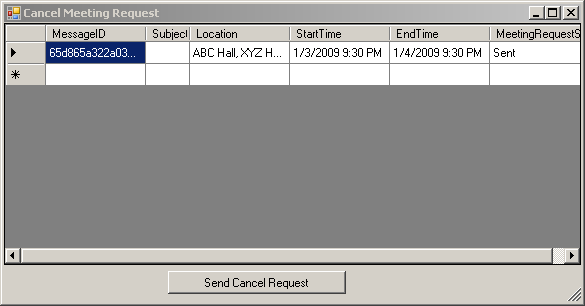

You can send a meeting cancellation request with Aspose.Email using the Appointment Class object. You need to have the original meeting request information to cancel the request. The example in this article first sends a meeting request, saves the information in a database and then cancels the request based of the message ID.
## **Sending Meeting Requests**
Before we can [cancel meeting requests](#cancelling-meeting-request), we have to send some out:

1. First create an instance of type SmtpClient for sending the message.
1. To gather attendee information, we have created a data grid so that users can enter the names and addresses of people whom the invitation should be sent.
1. After doing a for-each loop on the Rows collection of the grid, save all the attendee information in the MailAddressCollection collection.
1. Create an instance of the MailMessage class and necessary properties like From, To and Subject.
1. Create an instance of type Appointment and give location, start time, end time, organizers and attendees information.
1. Save all the information in an SQL Server database. DB related work is being done in the SaveIntoDB method.

The following code snippet shows you how to send meeting requests.


## **Cancelling Meeting Request**
To cancel a meeting request, first get the email message's message ID. Since we have saved this information in a database for this example, we can easily get it again. We have used a grid to load all the sent messages. The screenshot of the form is as below: 

1. Selecting the row for which to send the cancellation request.
1. Click **Send Cancel Request** to send the request.
1. The code gets the ID from the selected row of the grid and queries the database to get the attendee, message and calendar related information.
1. Create an instances of the Calendar Class and [MailMessage](https://apireference.aspose.com/email/net/aspose.email/mailmessage)
   class classes using the information retrieved from the database.
1. Use the Appointment.CancelAppointment() method to send the cancellation request.
1. Send the mail using the [SMTP](https://apireference.aspose.com/email/net/aspose.email.clients.smtp/smtpclient).

The following code snippet shows you how to cancel the meeting request.


