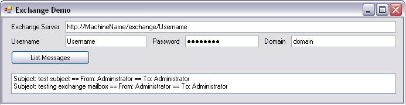

## **Aspose.Email.Mail Usage Scenarios**
This article suggests a number of possible uses for Aspose.Email for .NET, focusing in particular on the email programming features of the component.
### **Newsletter Software**
The [Aspose.Email.Mail](https://apireference.aspose.com/email/net/aspose.email) API can be used to create a robust newsletter application. Using Aspose.Email's support for adding embedded objects (like pictures, sounds etc.), it is possible to create rich HTML newsletters complete with images (and other embedded objects). Using the bulk mail feature of the Aspose.Email.Mail API, it is also possible to send huge bulk emails in a limited time period. Aspose.Email.Mail also provides template-based mail merge feature that can be used to create a newsletter template. The newsletter template can be used to perform a mail merge for sending bulk newsletter. There are many other possible tasks that Aspose.Email.Mail can perform in an email marketing application.
### **Other Marketing Tools**
Similar to newsletter applications, many other types of software can be built using Aspose.Email.Mail. Use it to build email marketing, mass mailer and e-campaign bulk mailer, and more.
### **Business Applications**
Aspose.Email.Mail can be used in almost all kinds of business applications to perform utility tasks:

- Email alerts: Send email alerts to inform users about activities.
- Meeting requests: Send business meeting requests using Aspose.Email.Mail's iCalendar support.
- Email scheduled reports: Reports are integral to most business applications. Many business reports are generated at intervals. Use Aspose.Email.Mail to email scheduled reports.
### **Email Clients**
Aspose.Email.Mail can also be used in email clients to send normal emails. It supports attachments, embedded objects, iCalendar events, mail merges, sending bulk emails, and so on, so Aspose.Email.Mail is the best option for creating Windows- or web-based email client applications.
## **Aspose.Email.Mail Sample Application**
To illustrate how to use Aspose.Email.Mail, we will create an application called 'My First Email' that demonstrates how to construct a email message with the [MailMessage class](https://apireference.aspose.com/email/net/aspose.email/mailmessage) and then send it using the SmtpClient class.
### **Mail : Sample Application Steps**
Please follow the steps below to create the 'My First Mail' application using Aspose.Email.

1. Open Visual Studio.
1. On the **File** menu, select **New**, then **Project**. (Choose to create either a C# or VB.NET Windows application).
1. If you have a license, then apply it to use the full version of Aspose.Email.
1. Import the Aspose.Email DLL into the application by right clicking **Reference** in the Solution Explorer.
1. Design your Windows application: create an interface that takes three fields: **From**, **To** and **Message**.
1. Double click the **Send** button in design view and write your code in the editor.
1. Create an instance of the MailMessage class and use its properties to construct an email message. (Instances of the MailMessage class are used to construct email messages that are transmitted to an SMTP server for delivery using the SmtpClient class).
1. Create an instance of the SmtpClient class and use its properties to sent an email message.
1. Test your Windows Application by pressing F5.
1. Type addresses in the **From** and **To** fields.
1. Type a message in the **Message Body** field.
1. Click **Send**.

The above steps are described below double click the **Send** button in design view and add the code below:



When connecting to an SSL enabled server, we need to set the following SMTPClient object properties


### **Conclusion**
[Aspose.Email.Mail](https://apireference.aspose.com/email/net/aspose.email) is a very powerful component with which developers can perform almost emails tasks, like sending multi-threaded bulk emails, using mail merge, adding attachments, embedding pictures and sounds into email messages, adding iCalendar events to emails, receiving emails and much more.
## **Aspose.Email.Pop3**
[Aspose.Email.Pop3](https://apireference.aspose.com/email/net/aspose.email.clients.pop3/pop3client) implements the Post Office Protocol v3 (POP3) on the .NET framework. It lets .NET developers add email querying and receiving features to their .NET applications without getting involved in protocol details and the complexity of email and network programming. Aspose.Email.Pop3 supports all the commands defined in the standard POP3 protocol, and provides easy-to-use interfaces along with a compact and intuitive object model. It greatly reduces the usual learning curve for .NET developers.
### **Pop3 : Main Features**
As part of Aspose.Email, Aspose.Email.Pop3 is designed specifically for .NET and is written in managed C# code. It lets you:

- Connect and log in to POP3 servers.
- Support APOP.
- Query messages.
- Retrieve messages.
- Fully support for Async programming style.
- Support SSL.
### **Aspose.Email.Pop3 Scenarios**
Aspose.Email.Pop3 can be used by developers in many different scenarios. Here, we share a couple.
### **Business Email Automation**
Aspose.Email.Pop3 can be used to query email inboxes and fetch email messages. It works smoothly with the email sending component, Aspose.Email.Mail. Aspose.Email fully supports email automation. Send email messages with Aspose.Email.Mail and fetch messages with Aspose.Email.Pop3. The downloaded email messages can then be parsed by Aspose.Email.Mime.
### **Email Clients**
Aspose.Email.Pop3 can be used in email client applications to receive emails.
### **Pop3 : Sample Application**
Here, we'll demonstrate how to use [Aspose.Email.Pop3](https://apireference.aspose.com/email/net/aspose.email.clients.pop3/pop3client). This class has many features but we'll concentrate on how to connect to a POP3 server and retrieve messages. The example shows how to create an application in Visual Studio as well as the code examples that get the application to work. Follow the steps given below to create a sample application using Aspose.Email.Pop3.

1. Open Visual Studio.
1. On the **File** menu, select **New** and then **Project**.
1. Choose either a C# or VB.NET Windows application.
1. Import the Aspose.Email.dll into the application by right-clicking **Reference** in the Solution Explorer.
1. Now design a Windows application as shown below.
1. Create an instance of Pop3Client.
1. Set the POP3 host name, login and password in this instance.
1. Call the Pop3Client's Connect() and Login() functions.
1. Create a MailMessage instance and fetch the first email in your account into it by calling the FetchMessage() function.
   This brings the first message from your email account into the MailMessage instance.
1. Use the MailMessage instance's From, Subject and HtmlBody properties to see the sender, subject and body of the message.

The above steps is demonstrated in the code examples below. Use the following code behind any button or in the OnLoad event of a form.



For SSL enabled servers, we need to change the following properties of the Pop3Client object:


## **Aspose.Email.Imap**
[Aspose.Email.Imap](https://apireference.aspose.com/email/net/aspose.email.clients.imap) implements the Internet Message Access Protocol (IMAP) on .NET frameworks. Aspose.Email.Imap lets .NET developers add IMAP capabilities to their .NET applications quickly, without having to understand the protocol detail. The component supports fetching and uploading messages, checking messages' new/read/unread status, and so on.
### **Imap : Main Features**
Aspose.Email.Imap allows you to:

- Fetch email messages.
- Upload email messages.
- List email messages on different folders.
- Check the status of email messages.
- Work with MailMessage.
- Work with SSL support.
### **Using Aspose.Email.Imap**
Aspose.Email.Imap implements the Internet Message Access Protocol on .NET frameworks. With it, developers can easily query and manage IMAP server emails, and create, delete or rename email folders. Using Aspose.Email.Imap, developers can take advantage of the IMAP protocol with easy to use APIs. They can access emails from any PC as the emails remain saved on the server. Using Aspose.Email.Imap, developers can create web or desktop applications that receive and manipulate emails from IMAP servers. Aspose implemented the IMAP protocol according to the internet authentication and RFC standards. Hence Aspose.Email.Imap is a secure and fully featured implementation of the IMAP protocol with an easy to understand object model and interfaces.
### **Imap : Sample Application**
This article explains how how to use [Aspose.Email.Imap](https://apireference.aspose.com/email/net/aspose.email.clients.imap). We create a small application that gets the number of email messages in your IMAP email account. Follow the steps given below to create a sample application using with Aspose.Email.Imap.

1. Open Visual Studio.
1. On the **File** menu, select **New** and then **Project**.
1. Choose either a C# or VB.NET Windows application.
1. Import the Aspose.Email.dll into this application by right-clicking on **Reference** in the Solution Explorer.
1. Create an instance of ImapClient by passing the IMAP server name, login and password.
1. Call the Connect() function of the ImapClient instance to connect to the server.
1. Call the ImapClient instance's SelectFolder() function to select the folder you want to count the number of messages in.
1. Now call the ImapClient instance's CurrentFolder.TotalMessageCount property to get the email message count.
### **Imap : Code Examples**
The code examples below go behind the button or in the OnLoad event on a form. They show how to implement the steps described above with Aspose.Email.



For SSL enabled mail servers, set the following properties of the ImapClient object:


## **Aspose.Email.Exchange**
[Aspose.Email.Exchange](https://apireference.aspose.com/email/net/aspose.email.clients.exchange/index) enables the developers to manage emails on Microsoft Exchange Server. Using this component you can connect, list messages and download emails from exchange server mailbox without understanding the underlying protocol details. The component supports listing messages, sending emails, downloading messages and saving to eml or msg format on your local disk etc.
### **Exchange : Main Features**
Aspose.Email.Exchange lets you:

- Connect to Microsoft Exchange Servers.
- List email messages in Exchange mailboxes.
- List email messages from different folders, for example, the Inbox, Sent, Deleted, or Drafts folders.
- Delete messages in any folder on Exchange Servers.
### **Using Aspose.Email.Exchange**
With Aspose.Email.Exchange, developers can access Exchange Server mailboxes from their .NET applications. It provides an easy to use API for managing emails on Exchange Servers. Developers can create console, desktop or web applications that manages emails in Exchange mailboxes.
## **Aspose.Email.Exchange Sample Application**
This article demonstrates how to use [Aspose.Email.Exchange](https://apireference.aspose.com/email/net/aspose.email.clients.exchange/index). We create a simple desktop application that connects to an Exchange Server mailbox, get the list of messages in the Inbox folder and display them on the windows form.
### **Exchange : Sample Application Steps**
1. Open Microsoft Visual Studio.
1. Create a new project. (Select the language of your choice C# or VB.NET)
1. Add a reference to the Aspose.Email.dll into your project by right-clicking the project and selecting **Add Reference** from the menu.
1. Design a Windows form like the one below:

To run the application successfully, you need the right credentials to accessing the Exchange Server. Here, we get the credential information - Exchange Server URI, username, password and domain - from the Windows form. This is a very basic sample so the message properties - subject, from and to - are simply displayed in the listbox.
### **Exchange : Code Examples**
Add the following code into the click even handler of the **List Messages** button.


### **Exchange : Output**
This screenshot shows the messages fetched from the Exchange Server. The ListMessages() method returns the basic information like subject, from, to and message ID. To get the full message, call the ExchangeClient.SaveMessage() method. (Using the ExchangeClient.SaveMessage() is described in the article [Saving Messages from Exchange Server Mailbox in EML and MSG Format](/email/net/working-with-exchange-mailbox-and-messages/#saving-messages).)

||
| :- |
## **Aspose.Email.Mime**
Multipurpose Internet Mail Extensions (MIME) is an Internet standard that extends the email format to support text in character sets other than US-ASCII, non-text attachments, multi-part message bodies, and header information in non-ASCII character sets. Aspose.Email.Mime implements the MIMI protocol on .NET frameworks. It acts like a translator as it can read an email from file (.eml etc) or from memory (string). It then parses the email file or string into meaningful parts. If you want to go through an email file without getting involved with MIME protocol details, for example to extract an attachment from an email, use Aspose.Email.Mime.
### **Main features**
Aspose.Email.Mime works perfectly with Aspose.Email.Pop3 and Aspose.Email.Mail.

- [Aspose.Email.Pop3](https://apireference.aspose.com/email/net/aspose.email.clients.pop3/pop3client) retrieves email messages from a specified mailbox.
- [Aspose.Email.Mail](https://apireference.aspose.com/email/net/aspose.email) sends email messages to a specified mailbox.
- [Aspose.Email.Mime](https://apireference.aspose.com/email/net/aspose.email.mime) is the hinge of the above two, and parses email messages.
