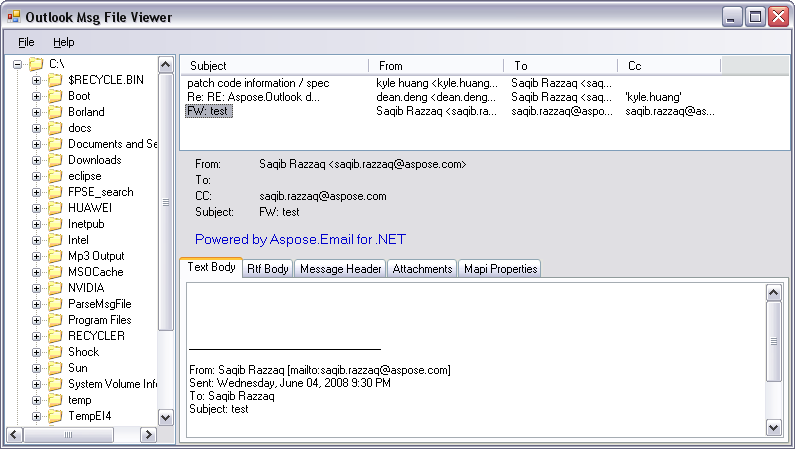
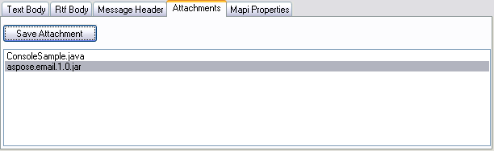

This article is about parsing and viewing Microsoft Outlook MSG files. If you have need to manipulate MSG files in your project or application, you need an API for parsing the Outlook MSG format. Or, if you do not have Microsoft Outlook installed on your system, you can build your own viewer to get the MSG file contents.

The code examples in this article shows how to parse an Outlook MSG file in a C# application using the Aspose.Email library. Aspose.Email is a .NET library available as a DLL. Use this library to view MSG files in Windows, web, console or any .NET based application. The trial version of Aspose.Email can be [downloaded easily](http://www.aspose.com/downloads/email/net). The source code for the project below is included in the samples provided with the installer.
## **Outlook MSG Viewer Demo**
We have created a simple demo application that can be used to parse and view MSG files. The UI can be seen below: 

The left pane shows the drives and folders on the system, just like Windows explorer does. You can browse the folders to show or filter the MSG files. Only MSG files appear in the top list view control in the corresponding folder in the treeview. As you can see from the screenshot above, the Subject, From, To and Cc fields are shown in the top list. If you click any MSG in the list, the corresponding message is opened and the details can be seen in the UI below the list view control. We have used labels to display the subject, to, cc and from information.

In the bottom pane, we have used tab controls to show other message details like the text body, RTF body, message header, attachments and MAPI properties. If you click the **Attachments** tab, it shows the list of attachments in the MSG file (if any). You can also save the attachments to your system by selecting an attachment and clicking the **Save** button. It opens the Save File dialog. Browse to the desired folder and save the file there. The following screenshot shows the **Attachments** tab view. 

## **Parsing and Viewing MSG File Contents Programmatically**
In this section, we will present the code that we used in the demo to show the MSG file contents.
### **Loading an MSG File**
The Aspose.Email library provides the [MapiMessage](https://apireference.aspose.com/email/net/aspose.email.mapi/mapimessage) class for loading and parsing MSG files. You can load the MSG file using a single line of code by calling the FromFile() static method and passing the path to the MSG file. The following code snippet shows you how to load an MSG file.


### **Getting the From, To, Cc and Subject from an MSG File**
The [MapiMessage](https://apireference.aspose.com/email/net/aspose.email.mapi/mapimessage) class exposes properties and collections for getting the subject, from, to, and cc information. Following is the sample code for getting these properties. The following code snippet shows you how to gett the From, To, Cc and Subject from an MSG File.


### **Getting the Text and RTF Bodies**
We can get the text and RTF bodies of the message by using properties of the [MapiMessage](https://apireference.aspose.com/email/net/aspose.email.mapi/mapimessage) class. The following code snippet shows you how to get text and RTF bodies.


### **Getting Attachments from MSG File and Saving to Disk**
The [MapiMessage](https://apireference.aspose.com/email/net/aspose.email.mapi/mapimessage) class provides the [Attachments](https://apireference.aspose.com/email/net/aspose.email.mapi/mapimessageitembase/properties/attachments) collection for getting all the attachments in the message (MSG) file. The MapiMessage.Attachments property returns an object of type MapiAttachmentCollection. You can use a for-each loop to iterate through the attachments collection and list the attachments. The Attachment class contains the Save() method for saving the individual attachment to disk. The following code snippet shows you how to get the list of attachments and saving them.


### **Getting the MAPI Properties of the MSG File**
You can get the MAPI Properties from the MSG file using the [MapiMessage](https://apireference.aspose.com/email/net/aspose.email.mapi/mapimessage) class Properties collection. The sample code below shows how to get all the MAPI properties in the message file.


