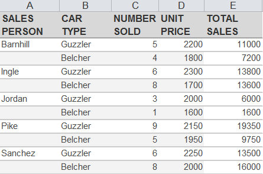
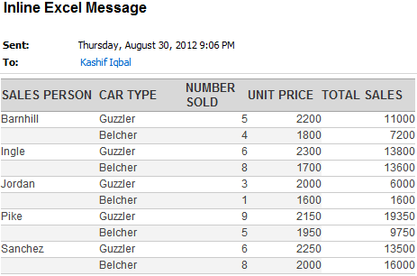

This article uses a Microsoft Excel workbook as the email body and sends it to recipients. Aspose.Email for .NET deals with network protocols and Microsoft Outlook features and cannot handle Microsoft Excel workbooks. To overcome this, the samples in this article use Aspose.Cells for .NET to load the Excel workbook and convert it to HTML stream. Aspose.Email for .NET, then, uses the HTML stream in the email body. The programming sample shows how to send an Excel worksheet as Email body using Aspose.Cells for .NET and Aspose.Email for .NET

1. Loading a Microsoft Excel Workbook using Aspose.Cells’ Workbook class
1. Save the loaded workbook to MemoryStream in HTML format
1. Get the HTML from the stream as String
1. Define a new MailMessage object and set its HtmlBody to the HTML content from step 3
1. Send the email using Aspose.Email for .NET’s SmtpClient class

The source Excel workbook can be seen as follow:

When the message has been sent and received in Microsoft Outlook, it looks like the message below:

The following code snippet shows you how to send MS Excel Worksheet as the Message Body and Sending Email.


