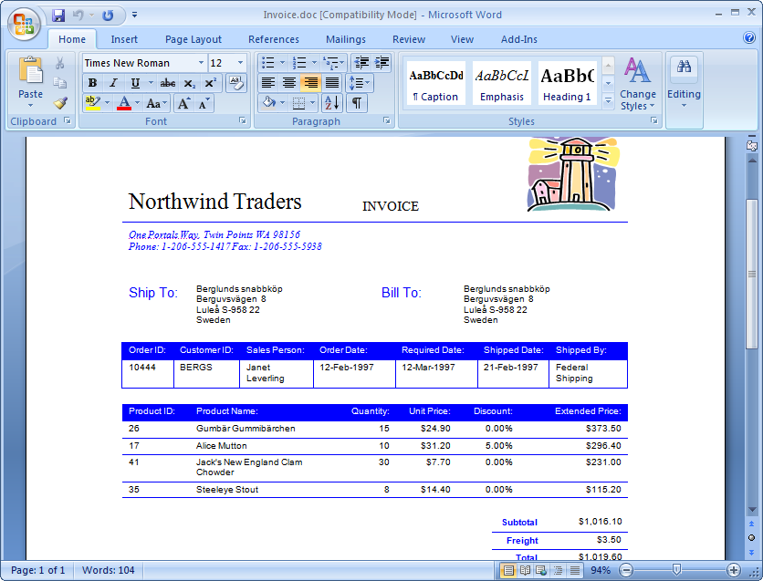
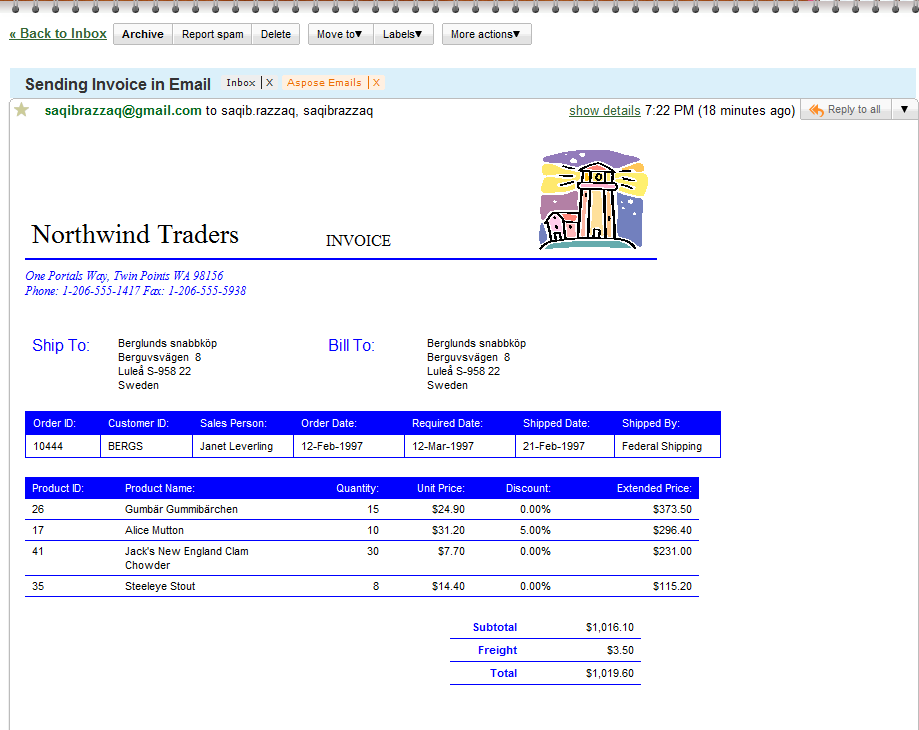

This article uses a Microsoft Word document as the email body and send it to recipients. The sample document is a sales invoice from the Northwind database sample, exported to Microsoft Word format. Aspose.Email for .NET deals with network protocols and Microsoft Outlook features and cannot handle Microsoft Word documents. To overcome this, the samples in this article use [Aspose.Words for .NET](http://www.aspose.com/categories/.net-components/aspose.words-for-.net/default.aspx) to load the Word document and convert it to MHTML format. Aspose.Email for .NET uses the MHTML document in the email body.
## **Using Microsoft Word Documents as Email Body**
The programming samples below illustrate how to send a Word document as an email body using Aspose.Words .NET and Aspose.Email for .NET:

1. Load a Microsoft Word document using Aspose.Word for .NET's Document}} class.
1. Save it in MHTML format.
1. Load the MHTML document using Aspose.Email for .NET's [MailMessage](http://www.aspose.com/api/net/email/aspose.email/mailmessage) class to set the email body.
1. Set other message properties using different [MailMessage](http://www.aspose.com/api/net/email/aspose.email/mailmessage) class properties and methods.
1. Send the email using Aspose.Email for .NET's [SMTP Client](http://www.aspose.com/api/net/email/aspose.email.clients.smtp/smtpclient) class.

The source document, a sales invoice exported to Microsoft Word from the Microsoft Northwind sample can be seen below. 

When the message has been sent and received in Microsoft Outlook, it looks like the message below. 

The HTML formatting and images are preserved as in the original source document when viewed in either Outlook or a web email client like Gmail or Hotmail. Below is a screenshot of the message when opened with Gmail in a Chrome browser. 

The following code snippet shows you how to use a Microsoft Word document as the message body and sending email.


