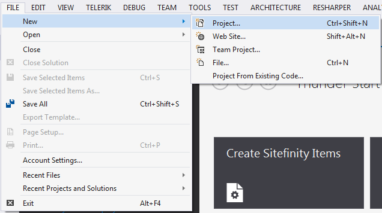
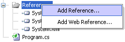
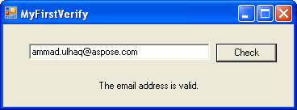

## **Using Aspose.Email.Verifications**
Aspose.Email.Verifications provides full support for validating email addresses. With the help of the Aspose.Email.Verifications.EmailValidator class, different types of validation can be performed, including email syntax checking, email domain checking and checking user accounts with mail servers. The ValidationPolicy enumeration is used to set the validation policy level:

- SyntaxOnly validates the email address syntax.
- SyntaxAndDomain validates the email address syntax, then validate the domain.
- MailServer validates the the address by trying to connect to the mail server.
## **Sample Application**
Aspose.Email.Verifications is a powerful and useful component to check the validity of email addresses, email domain names and much more. This article shows how to create an application using Aspose.Email.Verifications. The demo application checks the validity of an email address.

To create an application that uses Aspose.Email.Verifications to verify email addresses:

- Open Visual Studio.
- On the **File** menu, click **New** and then **Project**.
  For simplicity, this will be a console program. Choose C# or VB.NET project as you like.

|**Creating a new project**|
| :- |
||
- Add a reference to the console application.

|**Adding a reference to Aspose.Email**|
| :- |
||
- Browse to the Aspose.Email.dll It in the Bin directory under Aspose.Email's installation directory.

The following code snippet shows you how to validate an email address. When the code is executed, a message announces whether the email address is valid or not.



- Build and run.

|**Running the application.**||
| :- | :- |
|| |
## **Basic Validation Functionality**
Use Aspose.Email.Verifications to verify the validity of email addresses. For this purpose, Aspose.Email.Verifications has the EmailValidator class.
### **Validating Emails**
Aspose.Email's validation functionality can be used to validate email addresses, domain names and mail servers. The following code snippet shows you how to use EmailValidator to validate an email address.


### **Validating Domain**
Aspose.Email.Verifications can verify the validity of a domain name.
### **Validating Mail Server**
Aspose.Email.Verifications can verify the validity of a mail server.
