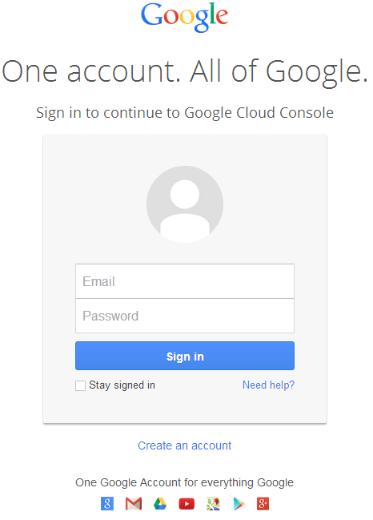
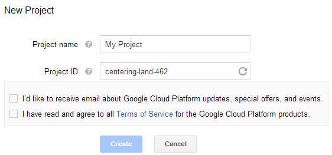
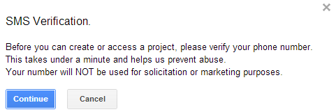
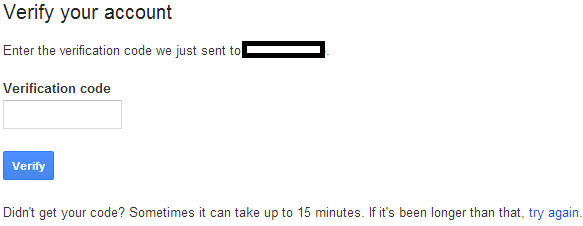
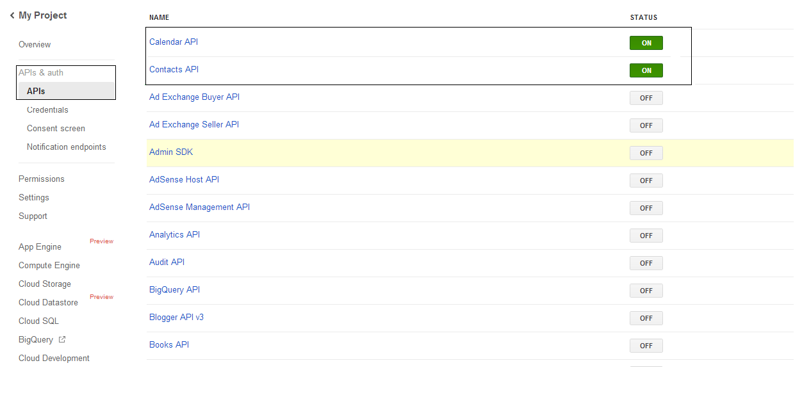
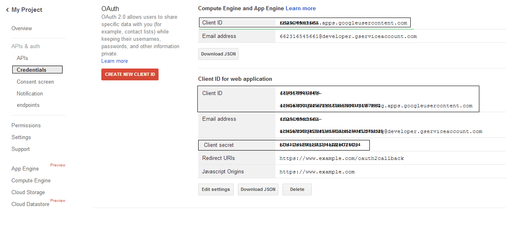

## **Working with FreeBusy Query**
Aspose.Email provides querying mechanism to check whether some appointment is due or not as per the criteria. FreebusyQuery class is provided for this purpose which allows to prepare a query for a particular calendar.
### **Querying a calendar**
This code sample demonstrates the feature of querying a calendar. Following tasks are performed in this sample:

1. Create and insert a calendar
1. Create an appointment
1. Insert appointment
1. Prepare a FreeBusyQuery
1. Get the FreebusyResponse

```csharp
// For complete examples and data files, please go to https://github.com/aspose-email/Aspose.Email-for-.NET
// Get access token
GoogleTestUser User2 = new GoogleTestUser("user", "email address", "password", "clientId", "client secret");
string accessToken;
string refreshToken;
GoogleOAuthHelper.GetAccessToken(User2, out accessToken, out refreshToken);

// Get IGmailClient
using (IGmailClient client = GmailClient.GetInstance(accessToken, User2.EMail))
{
    // Initialize calendar item
    Aspose.Email.Clients.Google.Calendar calendar1 = new Aspose.Email.Clients.Google.Calendar("summary - " + Guid.NewGuid().ToString(), null, null, "Europe/Kiev");

    // Insert calendar and get back id of newly inserted calendar and Fetch the same calendar using calendar id
    string id = client.CreateCalendar(calendar1);
    Aspose.Email.Clients.Google.Calendar cal1 = client.FetchCalendar(id);
    string calendarId1 = cal1.Id;
    try
    {
        // Get list of appointments in newly inserted calendar. It should be zero
        Appointment[] appointments = client.ListAppointments(calendarId1);
        if (appointments.Length != 0)
        {
            Console.WriteLine("Wrong number of appointments");
            return;
        }

        // Create a new appointment and Calculate appointment start and finish time
        DateTime startDate = DateTime.Now;
        DateTime endDate = startDate.AddHours(1);

        // Create attendees list for appointment
        MailAddressCollection attendees = new MailAddressCollection();
        attendees.Add("user1@domain.com");
        attendees.Add("user2@domain.com");

        // Create appointment
        Appointment app1 = new Appointment("Location - " + Guid.NewGuid().ToString(), startDate, endDate, "user2@domain.com", attendees);
        app1.Summary = "Summary - " + Guid.NewGuid().ToString();
        app1.Description = "Description - " + Guid.NewGuid().ToString();
        app1.StartTimeZone = "Europe/Kiev";
        app1.EndTimeZone = "Europe/Kiev";

        // Insert the newly created appointment and get back the same in case of successful insertion
        Appointment app2 = client.CreateAppointment(calendarId1, app1);

        // Create Freebusy query by setting min/max timeand time zone
        FreebusyQuery query = new FreebusyQuery();
        query.TimeMin = DateTime.Now.AddDays(-1);
        query.TimeMax = DateTime.Now.AddDays(1);
        query.TimeZone = "Europe/Kiev";

        // Set calendar item to search and Get the reponse of query containing 
        query.Items.Add(cal1.Id);
        FreebusyResponse resp = client.GetFreebusyInfo(query);
        // Delete the appointment
        client.DeleteAppointment(calendarId1, app2.UniqueId);
    }
    finally
    {
        // Delete the calendar
        client.DeleteCalendar(cal1.Id);
    }
}
```
## **Creating project in Google Developer Console**
A Project is to be created on Google Developer Console for a user having Gmail account. In the API & auth -> Credentials page of the Google project, information is to be noted like Client ID and Client Secret. This information along with the gmail account user name and password will be required for executing the code e.g. google calendar, access control lists, appointments, contacts, settings etc. in this section.
### **Steps to create a project in Google Developer Console**
Following is a step by step tutorial for creating a project in Google Developer Console.

1. Go to link <https://cloud.google.com/console/project> and login using your gmail credentials

||
| :- |
2. Select the check box "I have read and agree to all Terms of Service for the Google Cloud Platform products." and Press Create button

||
| :- |
3. "SMS Verification" will be requested. Press continue button:

||
| :- |
4. Enter your country name and enter mobile number. Press button: Send Verification Code

||
| :- |
5. Enter the verification code received on your mobile.

||
| :- |
6. In the APIs & auth \ APIs list switch on status of Calendar API and Contacts API. Switch OFF all others.

||
| :- |
7. On the APIs & auth -> Credentials, press button "CREAET NEW CLIENT ID" under "OAuth" section. Select "Installed application" and "Other" from the given choices, and press the "Create Client ID" button. Note the Client ID and Client Secret here that will be used in the sample codes in this section.

||
| :- |
## **Helper Classes**
Following helper classes are required to run the codes in this section. These classes GoogleOAuthHelper and GoogleTestUser are just for simplification of demonstration. The methods in these classes use non-public structure of web-pages that may change any time.
### **GoogleOAuthHelper Class**
The following code snippet shows you how to use GoogleOAuthHelper Class.

```csharp
// For complete examples and data files, please go to https://github.com/aspose-email/Aspose.Email-for-.NET
using System;
using System.Collections.Generic;
using System.Diagnostics;
using System.IO;
using System.Linq;
using System.Net;
using System.Text;
using System.Threading;
using System.Windows.Forms;

namespace Aspose.Email.Examples.CSharp.Email.Gmail
{
    internal class GoogleOAuthHelper
    {
        public const string TOKEN_REQUEST_URL = "https://accounts.google.com/o/oauth2/token";
        public const string SCOPE = "https%3A%2F%2Fwww.googleapis.com%2Fauth%2Fcalendar" + "+" + "https%3A%2F%2Fwww.google.com%2Fm8%2Ffeeds%2F" + "+" + "https%3A%2F%2Fmail.google.com%2F"; // IMAP & SMTP
        public const string REDIRECT_URI = "urn:ietf:wg:oauth:2.0:oob";
        public const string REDIRECT_TYPE = "code";

        internal static string GetAccessToken(TestUser user)
        {
            return GetAccessToken((GoogleTestUser)user);
        }

        internal static string GetAccessToken(GoogleTestUser user)
        {
            string access_token;
            string token_type;
            int expires_in;
            GetAccessToken(user, out access_token, out token_type, out expires_in);
            return access_token;
        }

        internal static void GetAccessToken(GoogleTestUser user, out string access_token, out string token_type, out int expires_in)
        {
            access_token = null;
            token_type = null;
            expires_in = 0;
            HttpWebRequest request = (HttpWebRequest)WebRequest.Create(TOKEN_REQUEST_URL);
            request.CookieContainer = new CookieContainer();
            request.Method = "POST";
            request.ContentType = "application/x-www-form-urlencoded";
            string encodedParameters = string.Format("client_id={0}&client_secret={1}&refresh_token={2}&grant_type={3}",
            System.Web.HttpUtility.UrlEncode(user.ClientId), System.Web.HttpUtility.UrlEncode(user.ClientSecret), System.Web.HttpUtility.UrlEncode(user.RefreshToken), System.Web.HttpUtility.UrlEncode(GrantTypes.refresh_token.ToString()));
            byte[] requestData = Encoding.UTF8.GetBytes(encodedParameters);
            request.ContentLength = requestData.Length;
            if (requestData.Length > 0)
                using (Stream stream = request.GetRequestStream())
                    stream.Write(requestData, 0, requestData.Length);
            HttpWebResponse response = (HttpWebResponse)request.GetResponse();
            string responseText = null;
            using (TextReader reader = new StreamReader(response.GetResponseStream(), Encoding.ASCII))
                responseText = reader.ReadToEnd();
            foreach (string sPair in responseText.Replace("{", "").Replace("}", "").Replace("\"", "").Split(new string[] { ",\n" }, StringSplitOptions.None))
            {
                string[] pair = sPair.Split(':');
                string name = pair[0].Trim().ToLower();
                string value = System.Web.HttpUtility.UrlDecode(pair[1].Trim());
                switch (name)
                {
                    case "access_token":
                        access_token = value;
                        break;
                    case "token_type":
                        token_type = value;
                        break;

                    case "expires_in":
                        expires_in = Convert.ToInt32(value);
                        break;
                }
            }
            Debug.WriteLine("");
            Debug.WriteLine("---------------------------------------------------------");
            Debug.WriteLine("-----------OAuth 2.0 authorization information-----------");
            Debug.WriteLine("---------------------------------------------------------");
            Debug.WriteLine(string.Format("Login: '{0}'", user.EMail));
            Debug.WriteLine(string.Format("Access token: '{0}'", access_token));
            Debug.WriteLine(string.Format("Token type: '{0}'", token_type));
            Debug.WriteLine(string.Format("Expires in: '{0}'", expires_in));
            Debug.WriteLine("---------------------------------------------------------");
            Debug.WriteLine("");
        }

        internal static void GetAccessToken(TestUser user, out string access_token, out string refresh_token)
        {
            GetAccessToken((GoogleTestUser)user, out access_token, out refresh_token);
        }

        internal static void GetAccessToken(GoogleTestUser user, out string access_token, out string refresh_token)
        {
            string token_type;
            int expires_in;
            GoogleOAuthHelper.GetAccessToken(user, out access_token, out refresh_token, out token_type, out expires_in);
        }

        internal static void GetAccessToken(TestUser user, out string access_token, out string refresh_token, out string token_type, out int expires_in)
        {
            GetAccessToken((GoogleTestUser)user, out access_token, out refresh_token, out token_type, out expires_in);
        }

        internal static void GetAccessToken(GoogleTestUser user, out string access_token, out string refresh_token, out string token_type, out int expires_in)
        {
            string authorizationCode = GoogleOAuthHelper.GetAuthorizationCode(user, GoogleOAuthHelper.SCOPE, GoogleOAuthHelper.REDIRECT_URI, GoogleOAuthHelper.REDIRECT_TYPE);
            GoogleOAuthHelper.GetAccessToken(authorizationCode, user, out access_token, out token_type, out expires_in, out refresh_token);
        }

        internal static void GetAccessToken(string authorizationCode, TestUser user, out string access_token, out string token_type, out int expires_in, out string refresh_token)
        {
            GetAccessToken(authorizationCode, (GoogleTestUser)user, out access_token, out token_type, out expires_in, out refresh_token);
        }

        internal static void GetAccessToken(string authorizationCode, GoogleTestUser user, out string access_token, out string token_type, out int expires_in, out string refresh_token)
        {
            access_token = null;
            token_type = null;
            expires_in = 0;
            refresh_token = null;
            HttpWebRequest request = (HttpWebRequest)WebRequest.Create(TOKEN_REQUEST_URL);
            request.CookieContainer = new CookieContainer();
            request.Method = "POST";
            request.ContentType = "application/x-www-form-urlencoded";
            string encodedParameters = string.Format("client_id={0}&code={1}&client_secret={2}&redirect_uri={3}&grant_type={4}", System.Web.HttpUtility.UrlEncode(user.ClientId), System.Web.HttpUtility.UrlEncode(authorizationCode), System.Web.HttpUtility.UrlEncode(user.ClientSecret), System.Web.HttpUtility.UrlEncode(REDIRECT_URI), System.Web.HttpUtility.UrlEncode(GrantTypes.authorization_code.ToString()));
            byte[] requestData = Encoding.UTF8.GetBytes(encodedParameters);
            request.ContentLength = requestData.Length;
            if (requestData.Length > 0)
                using (Stream stream = request.GetRequestStream())
                    stream.Write(requestData, 0, requestData.Length);
            HttpWebResponse response = (HttpWebResponse)request.GetResponse();
            string responseText = null;
            using (TextReader reader = new StreamReader(response.GetResponseStream(), Encoding.ASCII))
                responseText = reader.ReadToEnd();
            foreach (string sPair in responseText.Replace("{", "").Replace("}", "").Replace("\"", "").Split(new string[] { ",\n" }, StringSplitOptions.None))
            {
                string[] pair = sPair.Split(':');
                string name = pair[0].Trim().ToLower();
                string value = System.Web.HttpUtility.UrlDecode(pair[1].Trim());
                switch (name)
                {
                    case "access_token":
                        access_token = value;
                        break;
                    case "token_type":
                        token_type = value;
                        break;

                    case "expires_in":
                        expires_in = Convert.ToInt32(value);
                        break;

                    case "refresh_token":
                        refresh_token = value;
                        break;
                }
            }

            Debug.WriteLine(string.Format("Authorization code: '{0}'", authorizationCode));
            Debug.WriteLine(string.Format("Access token: '{0}'", access_token));
            Debug.WriteLine(string.Format("Refresh token: '{0}'", refresh_token));
            Debug.WriteLine(string.Format("Token type: '{0}'", token_type));
            Debug.WriteLine(string.Format("Expires in: '{0}'", expires_in));
            Debug.WriteLine("---------------------------------------------------------");
            Debug.WriteLine("");
        }

        internal static string GetAuthorizationCode(TestUser acc, string scope, string redirectUri, string responseType)
        {
            return GetAuthorizationCode((GoogleTestUser)acc, scope, redirectUri, responseType);
        }

        internal static string GetAuthorizationCode(GoogleTestUser acc, string scope, string redirectUri, string responseType)
        {
            Debug.WriteLine("");
            Debug.WriteLine("---------------------------------------------------------");
            Debug.WriteLine("-----------OAuth 2.0 authorization information-----------");
            Debug.WriteLine("---------------------------------------------------------");
            Debug.WriteLine(string.Format("Login: '{0}'", acc.EMail));
            string authorizationCode = null;
            string error = null;
            string approveUrl = string.Format("https://accounts.google.com/o/oauth2/auth?redirect_uri={0}&response_type={1}&client_id={2}&scope={3}", redirectUri, responseType, acc.ClientId, scope);

            AutoResetEvent are0 = new AutoResetEvent(false);
            Thread t = new Thread(delegate()
            {
                bool doEvents = true;
                WebBrowser browser = new WebBrowser();
                browser.AllowNavigation = true;
                browser.DocumentCompleted += delegate(object sender, WebBrowserDocumentCompletedEventArgs e) { doEvents = false; };
                Form f = new Form();
                f.FormBorderStyle = FormBorderStyle.FixedToolWindow;
                f.ShowInTaskbar = false;
                f.StartPosition = FormStartPosition.Manual;
                f.Location = new System.Drawing.Point(-2000, -2000);
                f.Size = new System.Drawing.Size(1, 1);
                f.Controls.Add(browser);
                f.Load += delegate(object sender, EventArgs e)
                {
                    try
                    {
                        browser.Navigate("https://accounts.google.com/Logout");
                        doEvents = true;
                        while (doEvents) Application.DoEvents();
                        browser.Navigate("https://accounts.google.com/ServiceLogin?sacu=1");
                        doEvents = true;
                        while (doEvents) Application.DoEvents();
                        HtmlElement loginForm = browser.Document.Forms["gaia_loginform"];
                        if (loginForm != null)
                        {
                            HtmlElement userName = browser.Document.All["Email"];

                            userName.SetAttribute("value", acc.EMail);
                            loginForm.InvokeMember("submit");
                            doEvents = true;
                            while (doEvents)
                                Application.DoEvents();

                            loginForm = browser.Document.Forms["gaia_loginform"];
                            HtmlElement passwd = browser.Document.All["Passwd"];
                            passwd.SetAttribute("value", acc.Password);

                            loginForm.InvokeMember("submit");
                            doEvents = true;
                            while (doEvents)
                                Application.DoEvents();
                        }
                        else
                        {
                            error = "Login form is not found in \n" + browser.Document.Body.InnerHtml;
                            return;
                        }
                        browser.Navigate(approveUrl);
                        doEvents = true;
                        while (doEvents) Application.DoEvents();
                        HtmlElement approveForm = browser.Document.Forms["connect-approve"];
                        if (approveForm != null)
                        {
                            HtmlElement submitAccess = browser.Document.All["submit_access"];
                            submitAccess.SetAttribute("value", "true");
                            approveForm.InvokeMember("submit");
                            doEvents = true;
                            while (doEvents)
                                Application.DoEvents();
                        }
                        else
                        {
                            error = "Approve form is not found in \n" + browser.Document.Body.InnerHtml;
                            return;
                        }
                        HtmlElement code = browser.Document.All["code"];
                        if (code != null)
                            authorizationCode = code.GetAttribute("value");
                        else
                            error = "Authorization code is not found in \n" + browser.Document.Body.InnerHtml;
                    }
                    catch (Exception ex)
                    {
                        error = ex.Message;
                    }
                    finally
                    {
                        f.Close();
                    }
                };
                Application.Run(f);
                are0.Set();
            });
            t.SetApartmentState(ApartmentState.STA);
            t.Start();
            are0.WaitOne();
            if (error != null)
                throw new Exception(error);
            return authorizationCode;
        }
    }
}
```

**Google OAuth Helper** should be used as follows.

```csharp
// The first user has to generate an authorization code URL.
string authUrl = GoogleOAuthHelper.GetAuthorizationCodeUrl(user);
// Then he has to open this url in browser and complete all operations.
// As result he will get authorization code.
// User has to use this authorization code to retrieve refresh token (TokenResponse.RefreshToken)
string authorizationCode = "put your authorization code here";
TokenResponse tokenInfo = GoogleOAuthHelper.GetAccessTokenByAuthCode(authorizationCode, user);
// When refresh token exists, user may use it to retrieve access token
tokenInfo = GoogleOAuthHelper.GetAccessTokenByRefreshToken(user);
```

### **TestUser Class**
The following code snippet shows you how to use TestUser Class.

```csharp
// For complete examples and data files, please go to https://github.com/aspose-email/Aspose.Email-for-.NET
using System;
using System.Collections.Generic;
using System.Linq;
using System.Text;

namespace Aspose.Email.Examples.CSharp.Email.Gmail
{
    internal enum GrantTypes
    {
        authorization_code,
        refresh_token
    }


    public class TestUser
    {
        internal TestUser(string name, string eMail, string password, string domain)
        {
            Name = name;
            EMail = eMail;
            Password = password;
            Domain = domain;
        }

        public readonly string Name;
        public readonly string EMail;
        public readonly string Password;
        public readonly string Domain;

        public static bool operator ==(TestUser x, TestUser y)
        {
            if ((object)x != null)
                return x.Equals(y);
            if ((object)y != null)
                return y.Equals(x);
            return true;
        }

        public static bool operator !=(TestUser x, TestUser y)
        {
            return !(x == y);
        }

        public static implicit operator string(TestUser user)
        {
            return user == null ? null : user.Name;
        }

        public override int GetHashCode()
        {
            return ToString().GetHashCode();
        }

        public override bool Equals(object obj)
        {
            return obj != null && obj is TestUser && this.ToString().Equals(obj.ToString(), StringComparison.OrdinalIgnoreCase);
        }

        public override string ToString()
        {
            return string.IsNullOrEmpty(Domain) ? Name : string.Format("{0}/{1}", Domain, Name);
        }
    }
}
```
### **GoogleTestUser Class**
The following code snippet shows you how to use GoogleTestUser Class.

```csharp
// For complete examples and data files, please go to https://github.com/aspose-email/Aspose.Email-for-.NET
using System;
using System.Collections.Generic;
using System.Linq;
using System.Text;

namespace Aspose.Email.Examples.CSharp.Email.Gmail
{
    public class GoogleTestUser : TestUser
    {
        public GoogleTestUser(string name, string eMail, string password)
            : this(name, eMail, password, null, null, null)
        { }

        public GoogleTestUser(string name, string eMail, string password, string clientId, string clientSecret)
            : this(name, eMail, password, clientId, clientSecret, null)
        { }

        public GoogleTestUser(string name, string eMail, string password, string clientId, string clientSecret, string refreshToken)
            : base(name, eMail, password, "gmail.com")
        {
            ClientId = clientId;
            ClientSecret = clientSecret;
            RefreshToken = refreshToken;
        }
        public readonly string ClientId;
        public readonly string ClientSecret;
        public readonly string RefreshToken;
    }
}
```
