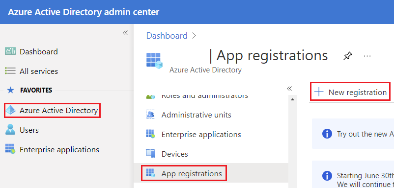
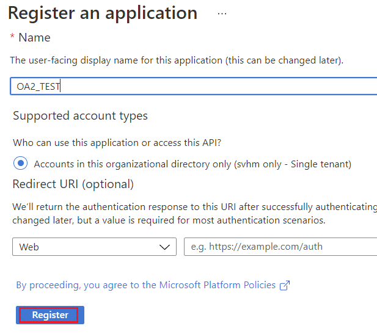
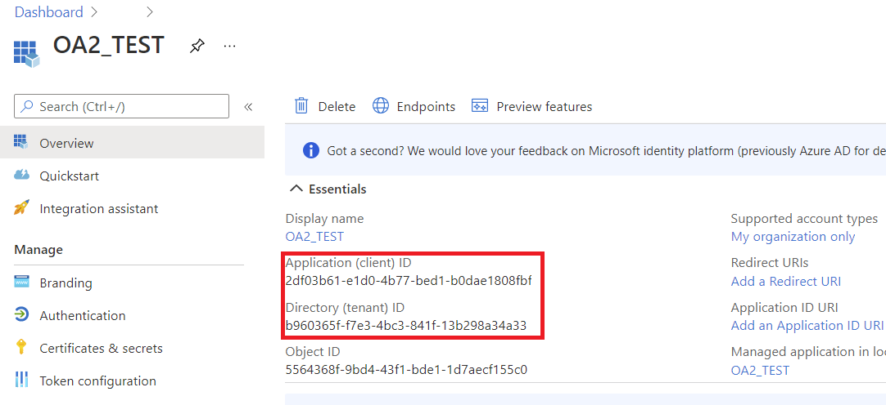
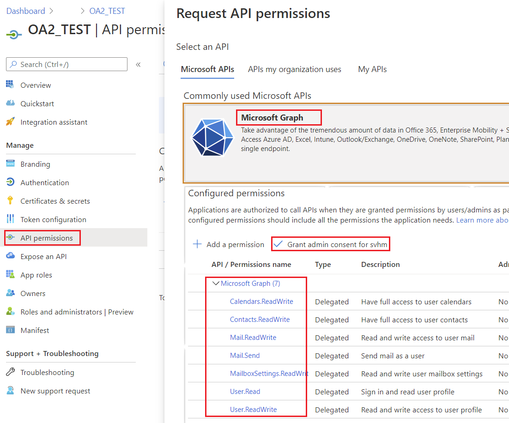
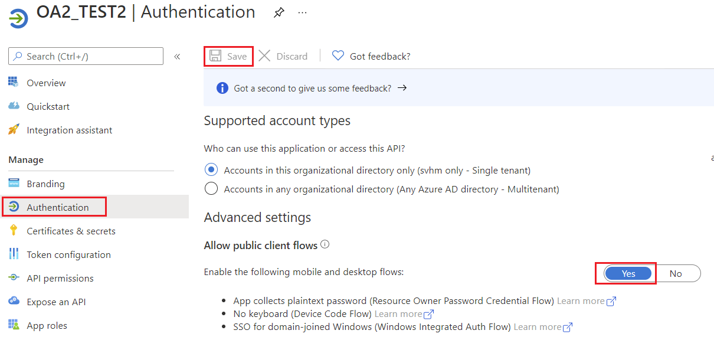
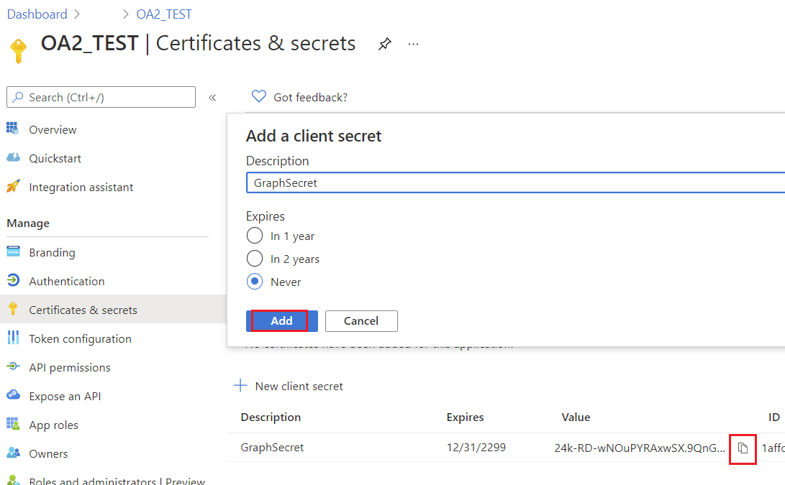

## **Creating Project in Azure Active Directory Admin Center**

A Project is to be created on Azure Active Directory admin center for a user having MS Office account.
### **Steps to Create a Project in Azure Active Directory Admin Center**

Following is a step by step tutorial for creating a project in Azure Active Directory admin center.

#### 1. Go to Azure Active Directory and login using your MS Office credentials.

**Azure Active Directory** Link - <https://aad.portal.azure.com/>

#### 2. Create an Azure AD Application in your tenant.

In the left side pane click the label **Azure Active Directory**. This will open up the blade for Azure Active Directory. In that screen should see a label **App registrations**. This is the starting point of a registering an Azure AD Application. This blade will allow you to create a new application for Azure AD.

Click on the button **New registration** to create a new application.

#### 3. Now you will see the new application registration blade.

- **Name** This will be the name of your application.
- **Supported account types** This section will restrict the access.

Click **Register** button.

#### 4. You should see the newly registered applications blade.

- **Application (client) ID** The id of your application.
- **Directory (tenant) ID** The Azure AD tenant id.

#### 5. Allowing permissions for Microsoft Graph API.

Click on the **API permissions** label.

Azure has already given you **User.Read** delegated permissions for your application. This permission will allow us to read user information for a logged in user. These are Microsoft Graph API permissions, in other hand we can call them as **Scopes**.

The full list of scopes for Microsoft Graph API - <https://docs.microsoft.com/en-us/graph/permissions-reference>.

Click on **+ Add a permission** button and select **Microsoft Graph**.

Click on **Delegated permissions**. Now you see a list of permissions available for Microsoft Graph API.

Select required permissions, click **Add permissions** button.

Click **Grant admin consent** button.

#### 6. Allow public client flows.

Specifies whether the application is a public client. Appropriate for apps using token grant flows that don't use a redirect URI.

#### 7. Create a key for the application

