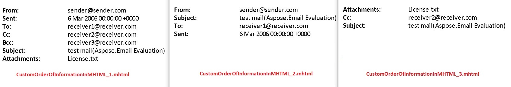

Aspose.Email provides [MhtSaveOptions.RenderingHeaders](https://apireference.aspose.com/net/email/aspose.email/mhtsaveoptions/properties/renderingheaders) property which returns the list of headers for rendering. You can add the headers by using the [MhtTemplateName](https://apireference.aspose.com/net/email/aspose.email/mhttemplatename) class. The order in which the headers are added decides the order in which the information is displayed.

The following image compares the three outputs generated by the sample code.

The following code snippet demonstrates the use of [MhtSaveOptions.RenderingHeaders](https://apireference.aspose.com/net/email/aspose.email/mhtsaveoptions/properties/renderingheaders) property to set the order in which the information is displayed in the output MHTML files.


