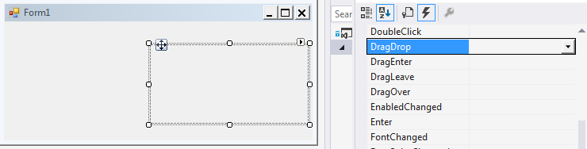
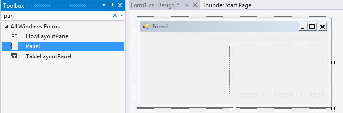

Microsoft Outlook's drag and drop feature is supported by Aspose.Email. It enables developers to easily create UI elements that respond to Outlook drag drop events. The following sample shows how to create a panel onto which users can drag a message from Outlook and drop it, and the program to save messages to MSG files. The following code snippet shows you how to set up an Aspose Outlook control that can receive dropped Microsoft Outlook messages.

- Create a windows form application.
- Add a reference to the Aspose.Email assembly.
- Browse to the Aspose.Email.dll and click **OK**.

The UI element created in this sample is a panel. To create a panel:

- Right-click your project in the solution panel and choose **Add** and then **New item** from the menu.
- Create a class called MyPanel:
- Let MyPanel be a subclass of System.Windows.Form.Panel, and add a Aspose.Email.Windows.Forms.FileDropTargetManager property to MyPanel:



- Override the OnHandleCreated and OnHandleDestroyed methods to register MyPanel using Aspose.Email.Windows.Forms.FileDropTargetManager:



- Build the project.

MyPanel is ready to use. This panel accepts drag and drop events from Outlook.

- Open your toolbox panel and drag MyPanel onto your windows form:

||
| :- |
- Add an event handler to MyPanel's DragDrop event. (Don't forget to set the AllowDrop} property to true from the properties panel and change MyPanel's BackColor property to your favorite.)

||
| :- |
- Add the following line in the InitializeComponent() method of the main Form:



- Implement the DragDrop event handler to save the messages dragged from Outlook to MSG files.
- Cast DragEventArgs to Aspose.Email.Windows.Forms.FileDragEventArgs which contains an array Files property that stands for the user's drag target.

If a user drags several messages from Outlook and drops it onto MyPanel, Files.Count is the number of messages, and Files i iterates for each message.



- Run the project and test it.

Now you can drag messages from Outlook and drop it to your application. The application prompts you to save those messages to MSG files.
