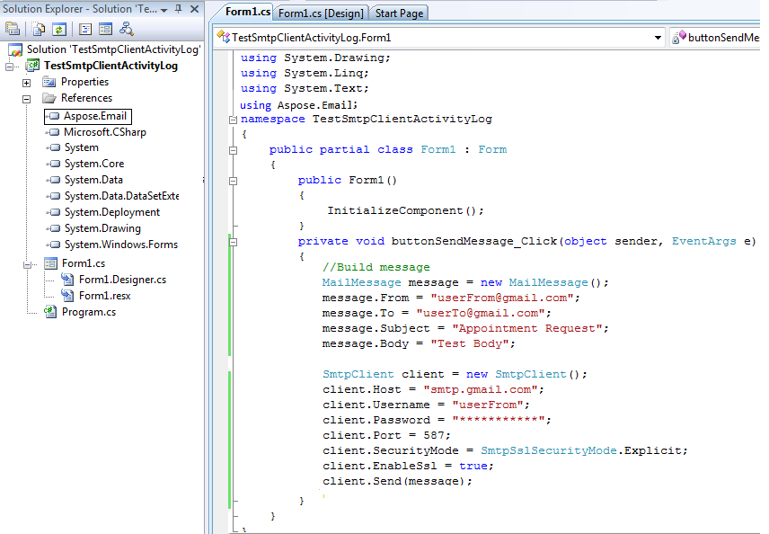
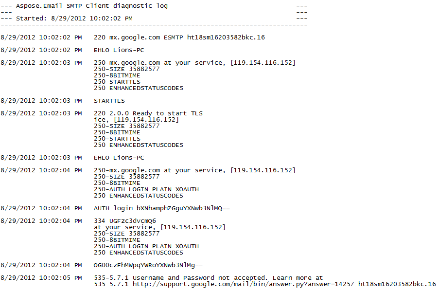

## **SMTP Client Activity Logging**
SMTP client activity can be logged by modifying the configSections in the config file. Following are the steps to perform diagnostics logging:

- Add a sectionGroup called "applicationSettings".
- Add a section called "Aspose.Email.Properties.Settings".
- Include the setting with the name SmtpDiagonosticLog where the file name is defined in the applicationSettings/Aspose.Email.Properties.Settings

Here is a sample form based application which uses [SmtpClient](https://apireference.aspose.com/net/email/aspose.email.clients.smtp/smtpclient) to send an email. This whole activity is logged by modifying the App.config file. Create a form application with a single button on it. Add the following code for button’s click:



- Add reference to Aspose.Email.

||
| :- |
- Add the App.Config file and modify it in such a way that file contents are as follows



- For C# .NET use the following option

||
| :- |
- For VB .NET use the following option

|| ||
| :- | :- | :- |

||
| :- |
- Run the code and then observe the debug folder. The following file will be generated.

||
| :- |
