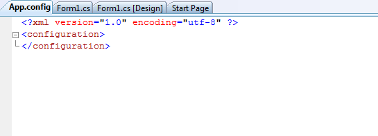
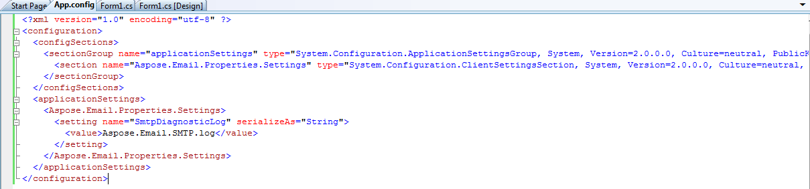

# Utility Features - SMTP Client
## **Listing Extension Servers using Smtp Client**
Aspose.Email's [SmtpClient](https://apireference.aspose.com/net/email/aspose.email.clients.smtp/smtpclient) lets you retrieve the server extensions that a server supports such as IDLE, UNSELECT, QUOTA, etc. This helps in identifying the availability of an extension before using the client for that particular functionality. The [GetCapabilities()](https://apireference.aspose.com/net/email/aspose.email.clients/emailclient/methods/getcapabilities) method returns the supported extension types in the form of a string array.
### **Retrieving Server Extensions**
The following code snippet shows you how to retrieve server extensions.


## **SMTP Client Activity Logging**
SMTP client activity can be logged by modifying the configSections in the config file. Following are the steps to perform diagnostics logging:

- Add a sectionGroup called "applicationSettings".
- Add a section called "Aspose.Email.Properties.Settings".
- Include the setting with the name SmtpDiagonosticLog where the file name is defined in the applicationSettings/Aspose.Email.Properties.Settings

Here is a sample form based application which uses [SmtpClient](https://apireference.aspose.com/net/email/aspose.email.clients.smtp/smtpclient) to send an email. This whole activity is logged by modifying the App.config file. Create a form application with a single button on it. Add the following code for button’s click:



- Add reference to Aspose.Email.

||
| :- |
- Add the App.Config file and modify it in such a way that file contents are as follows



- For C# .NET use the following option

||
| :- |
- For VB .NET use the following option

|| ||
| :- | :- | :- |

||
| :- |
- Run the code and then observe the debug folder. The following file will be generated.

||
| :- |
## **Working with Signed Message**
Aspose.Email API provides the capability to create Signed messages using certificates. The [AttachSignature](https://apireference.aspose.com/net/email/aspose.email/mailmessage/methods/attachsignature/index) method of the [MailMessage](https://apireference.aspose.com/net/email/aspose.email/mailmessage) class can be used to sign a message for saving or even sending it using the [SmtpClient](https://apireference.aspose.com/net/email/aspose.email.clients.smtp/smtpclient).
### **Sign a Message**
The following code snippet shows you how to Sign a Message.


### **Using Detached Certificate Option**
Web-based email clients may not be able to display body contents of a Signed message. This can be taken care of by detaching the certificate before sending it to web-based email clients. The detached flag in the overloaded method of [AttachSignature](https://apireference.aspose.com/net/email/aspose.email/mailmessage/methods/attachsignature/index) can be used to achieve this. If set to **true**, the certificate is detached from the email and vice versa. To see Signed Message body in Web-based clients, you need to create [MailMessage](https://apireference.aspose.com/net/email/aspose.email/mailmessage) with detached signature. The following code snippet shows you how to use detached certificate option.


