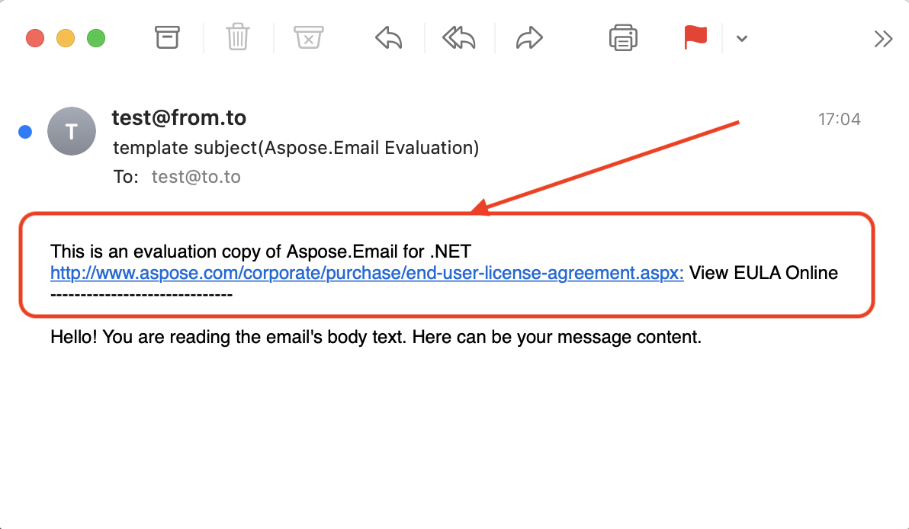

You can try all the features of Aspose.Email for free. All you need to do for this — download Aspose.Email for evaluation. 
The evaluation version of Aspose.Email is the same as the purchased download. 
You can easily make the evaluation version licensed by adding a few lines of code to apply the license.

As we have mentioned above, the evaluation version of Aspose.Email (without a license specified) provides full product functionality, but it inserts an evaluation watermark at the top of the document on any action like open, save, convert, etc.

{} 

Read more about evaluation limitations: [Evaluation Version Limitations](/email/net/licensing/#evaluation-version-limitations).

{}

{} 

If you want to test **Aspose.Email** without the evaluation version limitations, you can also request a **30-day Temporary License**. The free trial will give you a good idea of the service’s capabilities and let you do some early development. 
Please refer to [How to get a Temporary License?](https://purchase.aspose.com/temporary-license)

{}
