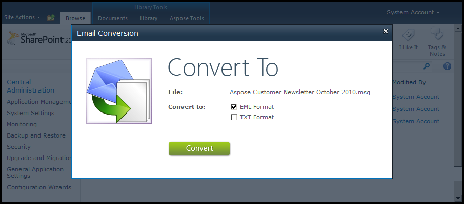

{} 

With Aspose.Email for SharePoint installed, you can convert emails in a document library from one format to another. Attachments, embedded images and formatting of text are, most cases, preserved by the conversion process. 

{} 

Aspose.Email for SharePoint supports loading of the following email documents: 

- EML – Standard MIME formatted email.
- MSG – Outlook MSG file format.

[Find out more about conversion](/email/sharepoint/email-conversion/).
