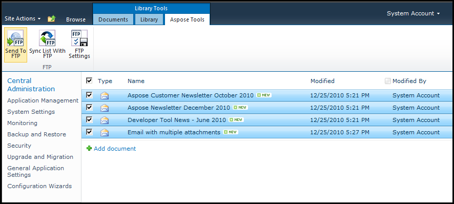

{} 

With Aspose. Email for SharePoint installed and activated, the “Aspose Tools” ribbon becomes available in the document library. It includes features for transferring files to the FTP server. You can select any file(s) and send to FTP server. 

{} 

**Sending files to FTP.** 

[Find out more about how to send files to FTP](/email/sharepoint/send-selected-files-to-ftp-server/).
