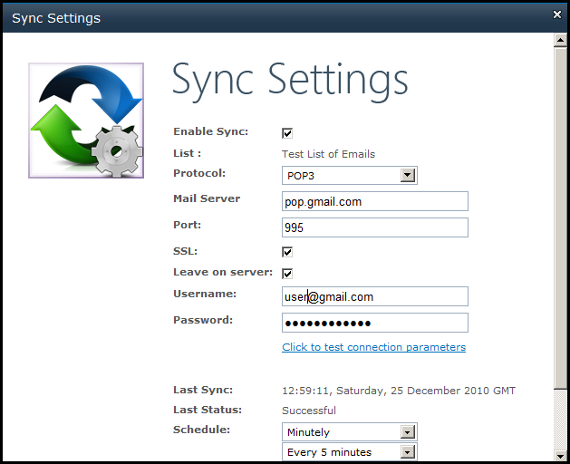

{} 

Synchronize emails in SharePoint's custom list of emails with a mail server. Installing and activating Aspose.Email for SharePoint adds the **Aspose Tools** ribbon to the custom list of emails. You can define the following settings for the email synchronization:

|
- Mail Protocol

- POP3

- IMAP

- Microsoft Exchange

- Mail server address
|
- Port

- SSL security

- Username

- Password

- Schedule (the hours or minutes after which the synchronization will take place).
|
| :- | :- |
[Read more about email synchronization](/email/sharepoint/email-synchronization/).

{}

**Setting up synchronization.** 

