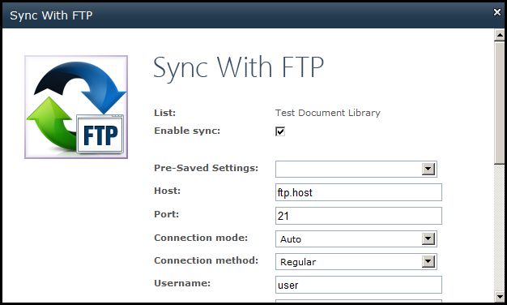

{} 

Aspose.Email for SharePoint includes features for synchronizing files in the document library with an FTP server. You can define the following settings for synchronization:

- FTP server details (host, port, username and password).
- Folder on FTP server to sync files with.
- File transfer direction: 
  - SharePoint to FTP.
  - FTP to SharePoint.
- Schedule (number of minutes).

{} 

**Synchronize files with FTP.** 

[Find out more about synchronizing files with FTP servers](/email/sharepoint/synchronize-files-with-ftp-server/).
