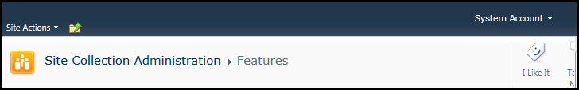
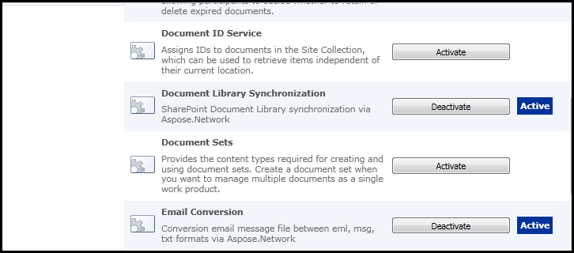

{} 

After [installing Aspose.Email for SharePoint](/email/sharepoint/installing-aspose-email-for-sharepoint/), activate the features at the root website. 

{} 
## **Activating and De-activeting Aspose.Email**
To activate or de-activate features: 

1. Click the **Site Actions** menu and select **Site Settings**. 

1. In the **Site Collection Administration** category, click **Site Collection Features** to open the page for activating and de-activating features. 

When the features have been activated, the **Aspose Tools** ribbon is available in the SharePoint document library. 

