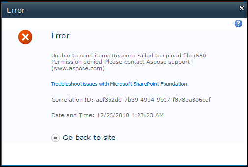
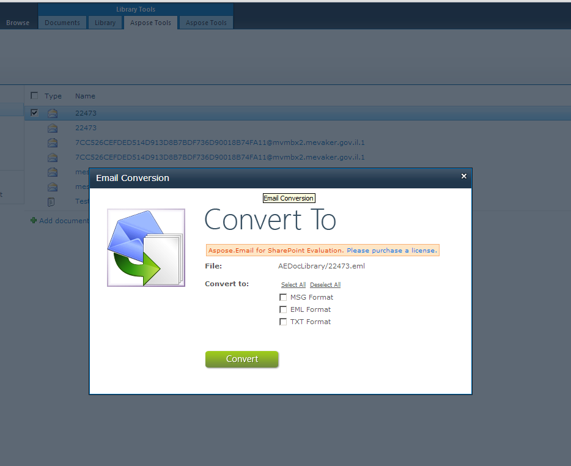

{} 

The evaluation version of Aspose.Email for SharePoint has no time limit, and free technical support is available for evaluation users too.

{} 
## **Installing and Using the Evaluation Version**
The full and evaluation versions of Aspose.Email are installed from the same download.To get the evaluation version, simply:

1. Download Aspose.Email for SharePoint from the [download page](http://www.aspose.com/community/files/73/sharepoint-components/aspose.email-for-sharepoint/default.aspx).
1. [Install it](/email/sharepoint/installing-aspose-email-for-sharepoint//).

By default, Aspose.Email runs in evaluation mode. To run the full version, [license Aspose.Email](/email/sharepoint/license-aspose-email-for-sharepoint//).
### **Evaluation Version Limits**
The evaluation version has the following limits: 

- An evaluation message is displayed on all setting's screens.
- FTP File transfer is limited to 256 KB. If the size of the files selected for transfer exceeds this limit, an error is displayed.
- An evaluation message is added to the subject of emails during message file format conversion.
- An evaluation message is added to the subject of emails when synchronizing emails with the mail server. 

