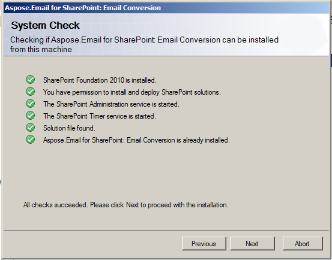
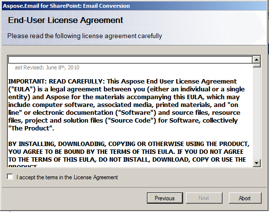
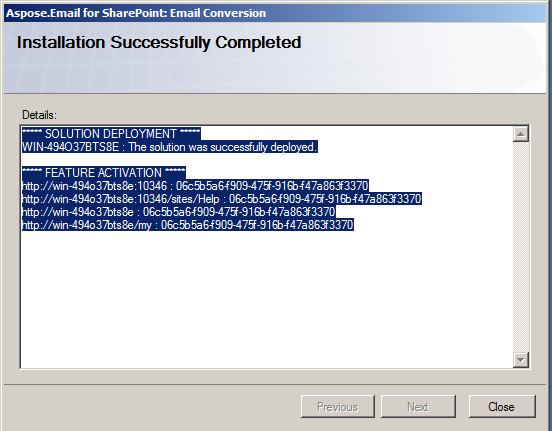

{} 

Aspose.Email for SharePoint is downloadable as [Aspose.Email.SharePoint2010.zip](http://www.aspose.com/community/files/73/sharepoint-components/aspose.email-for-sharepoint/default.aspx) archive. 

{} 
## **Installation**
### **Archive Content**
The Aspose.Email for SharePoint archive contains folders:

1. **Email Conversion**: Convert email file formats and attachments extraction from EML and MSG files in a document library.
1. **Email Synchronization**: Email's synchronization between SharePoint’s custom list of emails and mail server.
1. **Document Library Synchronization**: File synchronization between the document library and FTP server.

Each folder contains license agreement and installation files:

1. **wsp file**: SharePoint solution file. Aspose.Email for SharePoint is packaged as a SharePoint solution to facilitate deployment/retraction across the server farm.
1. **Aspose_LicenseAgreement.rtf**: End user license agreement
1. **Setup.exe**: Setup program
1. **Setup.exe.config**: Setup configuration file.

The setup program checks the following conditions before carrying out the installation:

1. SharePoint Foundation 2010 is installed.
1. The user has permission to install SharePoint solutions.
1. SharePoint Foundation 2010 Administration service is started.
1. SharePoint Foundation 2010 Timer service is started.

{} 

WSS Administration service and Timer service are needed because some setup actions rely on a timer job to propagate to all servers in the server farm.

{} 
### **Installing Aspose.Email**
To install Aspose.Email for SharePoint:

1. Unpack the Aspose.Email for SharePoint SIP to the local drive on the SharePoint 2010 server.
1. Run Setup.exe and follow the instructions on the screen. The setup program performs the following actions: 
   1. Checks installation prerequisites. Setup will not continue if any check fails. 

1. Displays the end user license agreement. The user must accept the agreement to proceed 

1. Installs and deploys the feature to the server farm 

