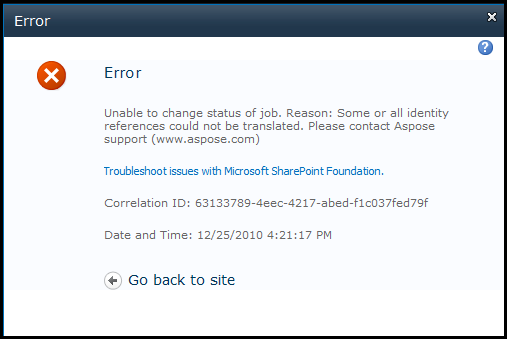

## **Error: Some or all identity references could not be translated**
If you see errors like “Some or all identity references could not be translated”, you may run the following command to resolve them.

**[DOS]**

``` cs


stsadm.exe -o updatefarmcredentials -userlogin <DOMAIN\username> -password <password>


```

{} 

If the "Some or all identity references" error message appears, you may also need to reset IIS services using “iisreset” or restart the operating system. 



{}
