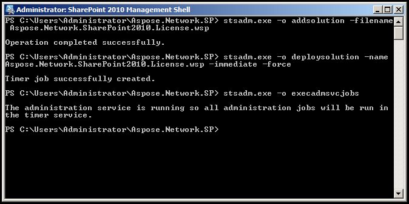

{} 

Once you are happy with your evaluation, you can [buy a license](http://www.aspose.com/purchase/default.aspx). Before purchasing make sure you understand and agree to the license terms.

The license is emailed to you after the order has been paid. The license is a ZIP archive that contains a regular SharePoint solution package.

The ZIP archive contains:

- **Aspose.Email.SharePoint.License.wsp**: SharePoint solution package file. The Aspose.Email for SharePoint license is packaged as a SharePoint solution to facilitate deployment/retraction across the server farm.
- **readme.txt**: License installation instructions. The license is installed from the server console via the stsadm.exe file. The steps required to install the license are given below.

{} 
## **Installing the License from WSP solution**
In the instructions below, paths are omitted for clarity. You may need to add the actual path to stsadm.exe and/or solution file when executing them.

To install the Aspose.Email license:

1. Run the SharePoint 2010 Management Shell.
1. Run stsadm to add the solution to the SharePoint solution: 

``` java

 stsadm.exe \-o addsolution \-filename Aspose.Email.SharePoint.License.wsp

```

1. Deploy the solution to all servers in the farm: 

``` java

  stsadm.exe \-o deploysolution \-name Aspose.Email.SharePoint.License.wsp \-immediate --force

```

1. Execute administrative timer jobs to complete the deployment immediately: 

``` java

 stsadm.exe \-o execadmsvcjobs

```

If the Windows SharePoint Services Administration service has not been started when you deploy the license, an error is shown. Stsadm.exe relies on this service and Windows SharePoint Timer Service to replicate solution data across the farm. If these services are not running on your server farm, you may need to deploy the license on each server. 


## **Installing the License from LIC file**
In order to install the license from Lic file, you need to place the license file in the Aspose.Network.SharePoint.License folder as follow:

InstalledDrive\Program Files\Common Files\Microsoft Shared\Web Server Extensions\14\Template\Features\Aspose.Network.SharePoint.License

The following License names are recognized by Aspose.Email for Sharepoint API:

1. Aspose.Network Product Family.lic
1. Aspose.Email.SharePoint.lic
1. Aspose.Email Product Family.lic
1. Aspose.Total for Sharepoint.lic
1. Aspose.Total Product Family.lic
