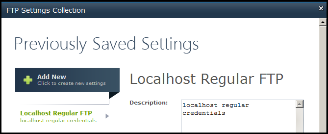

{} 

To test that a license has been installed successfully, open any Settings page. The evaluation version message should now be gone. Below is a screenshot of the FTP Settings Collection page without the evaluation message. 

{} {} 

You may also try to do all the operations listed in Evaluation Aspose.Email for SharePoint to verify that the license has been successfully applied.

{}
