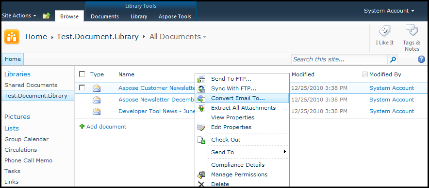
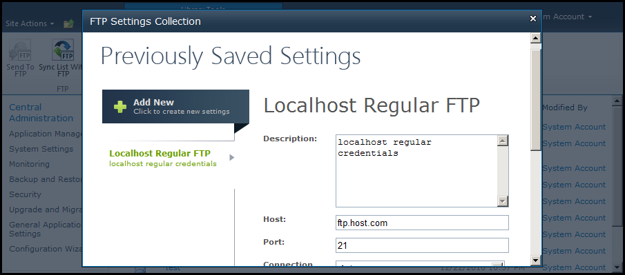
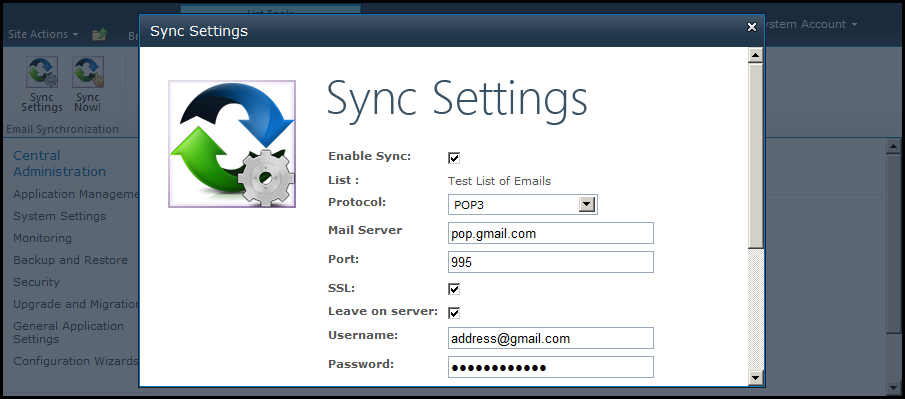
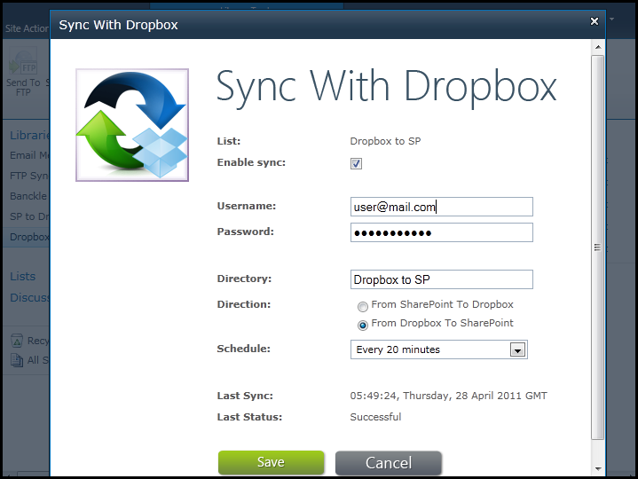

{} 

## **Welcome to Aspose.Email for Sharepoint!**
[Aspose.Email for SharePoint](http://www.aspose.com/categories/sharepoint-components/aspose.email-for-sharepoint/default.aspx) is a flexible solution for converting email files and synchronizing emails from within MicroSoft SharePoint applications.

This manual describes Aspose.Email for SharePoint's [features](/sharepoint/features/), [installation](/sharepoint/installing-aspose-email-for-sharepoint/), [licensing](/sharepoint/license-aspose-email-for-sharepoint/), settings and [common uses](/sharepoint/overview/). 

{} 
## **Email Conversion**
The email conversion utility supports loading of the following file formats:

- EML – Standard MIME Email
- MSG – Microsoft Outlook Message File Format
## **Platform Support**
Aspose.Email for SharePoint is designed to be used with the following products:

- Microsoft SharePoint Server 2010

{} 

Aspose.Email for SharePoint does not have any system requirements beyond those for the SharePoint Server it's installed on.

{}
## **Feature Overview**
### **Convert an Email**
Use Aspose.Email for SharePoint from the SharePoint document library to [convert an email document](/sharepoint/email-conversion/): 

### **Synchronize Files**
Synchronize files in the [SharePoint document library](/sharepoint/document-library-synchronization/) with FTP Server: 

[Synchronize a SharePoint custom list of emails](/sharepoint/email-synchronization/) with a mail server using POP3, IMAP or Exchange: 

Synchronize files in a SharePoint Document Library with [Dropbox file sharing](/sharepoint/synchronize-files-with-dropbox/): 

