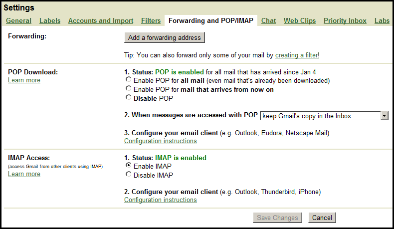
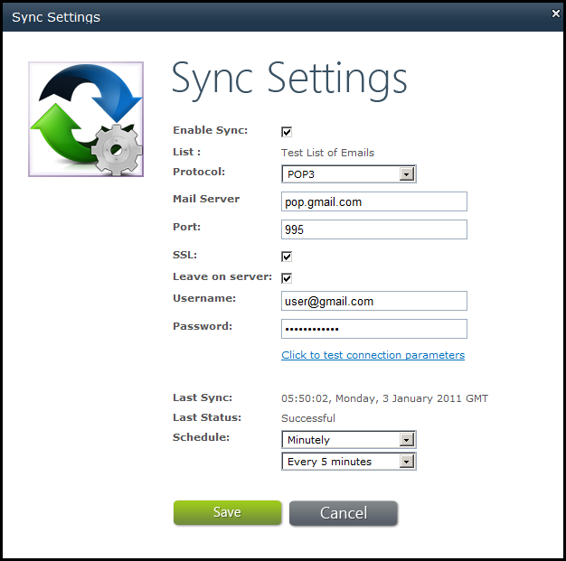
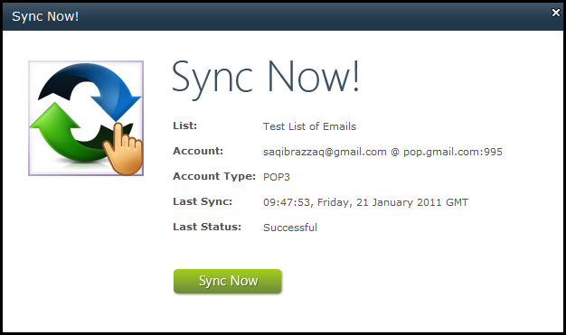
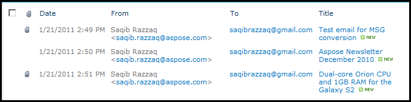
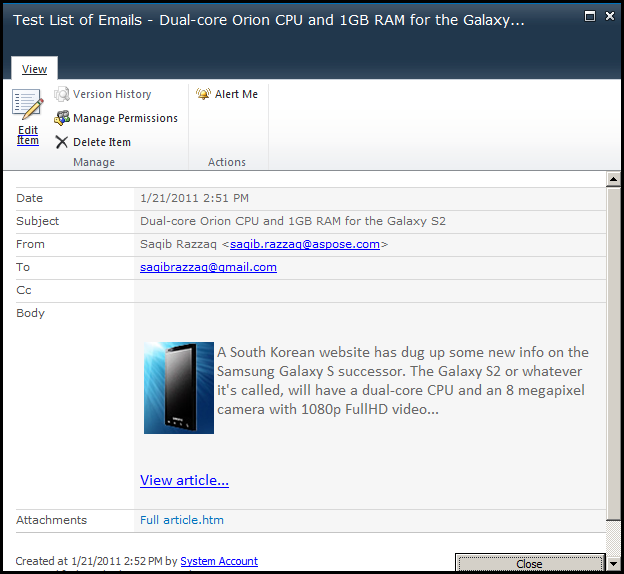

{} 

Aspose.Email for SharePoint supports both POP3 and IMAP protocols when synchronizing emails. Gmail also allows free POP and IMAP access to email clients like Outlook Express, Microsoft Office Outlook, Thunderbird or any API like Aspose.Network. 

This article shows how to use Aspose.Email for SharePoint's email synchronization feature to synchronize emails with Gmail.

{} 
## **Synchronizing Emails**
Aspose.Email for SharePoint's email conversion component is an easy-to-use tool for synchronizing emails with SharePoint’s custom list of emails. With support for popular protocols and email servers, like POP3, IMAP and Microsoft Exchange Server, Aspose.Email can connect with a variety of email servers and synchronize email. 

This article explains how to [set up Gmail](/email/sharepoint/synchronize-emails-with-gmail/) so that emails can be downloaded, [set up SharePoint](/email/sharepoint/synchronize-emails-with-gmail/) to synchronize emails and how to [run the synchronization manually](/email/sharepoint/synchronize-emails-with-gmail/).
### **Setting up Gmail**
To get emails from Gmail using an email client, POP or IMAP must be enabled from the Gmail settings page. By default, it is disabled.

To enable POP3 and IMAP:

1. Log in to your Gmail account and click **Settings** in the top right corner.
1. Click **Forwarding and POP/IMAP** to change POP and IMAP settings.
1. Enable POP and choose the appropriate “Enable POP” option: 
   1. **Enable POP for all mail** to download all emails (new and old).
   1. **Enable POP for mail that arrives from now on** to download new emails only.
1. Enable IMAP. 
   For IMAP, there are only two choices: 
   1. **Enable** to download all messages from your mailbox.
   1. **Disable** turns off the service. Don't select this option. 

      **The Forwarding and POP/IMAP tab in Gmail** 

### **Setting up Aspose.Email for SharePoint**
1. In SharePoint, click **Sync Settings** on the **Aspose Tools** ribbon to open the settings window.
1. Specify Gmail’s POP3 settings to synchronize with Gmail using POP3 protocol. Enter the following information in this screen: 
   1. Enable Sync: check
   1. Protocol: POP3
   1. Mail server: pop.gmail.com
   1. Port: 995
   1. SSL: check
   1. Leave on Server: check
   1. Username: username@gmail.com (specify complete email address)
   1. Password: specify Gmail’s password
   1. Schedule: choose “Minutely” and “Every 5 minutes” or whatever suits you 
      **The Sync Settings dialog.** 

1. Verify the connection by clicking **Click to test connection parameters**. If there is anything wrong with the credentials or host address, an error message is displayed.
1. Click **Save** to save the settings.
   Aspose.Email for SharePoint tries to connect to Gmail every 5 minutes (or any other time specified). It downloads messages and updates email list.

All attachments, embedded images and body formatting is preserved when downloading the messages and creating emails in SharePoint’s custom list of emails. 
### **Synchronizing Emails Manually**
To start synchronization manually: 

1. Click **Sync now** on the **Aspose Tools** ribbon. The Sync Now dialog is displayed. The Sync Now screen shows a summary of email account settings and the last sync status. 

   **The Sync Now dialog.** 

1. Click **Sync Now**. 

   **Emails listed in a SharePoint list after successful synchronization** 

1. Click on any email on the list to open it in SharePoint.

   **An email displayed in SharePoint.** 

## **References**
- [Installing Aspose.Email for SharePoint](/email/sharepoint/install-aspose-email-for-sharepoint/)
- [Synchronize Emails with Mail Server](/email/sharepoint/email-synchronization/)
- [About Email Synchronization Component for SharePoint](/email/sharepoint/about-email-synchronization/)
