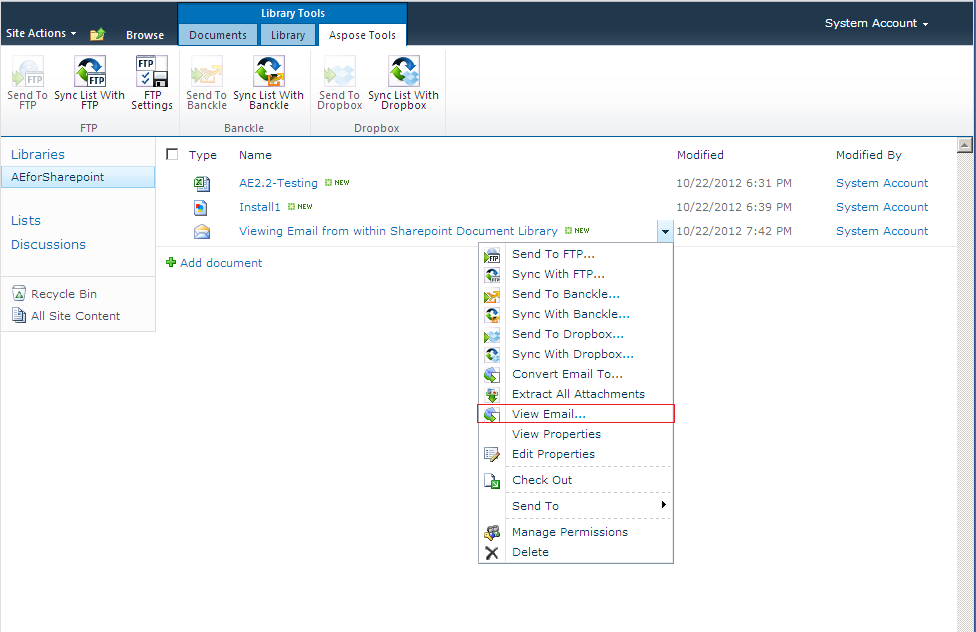
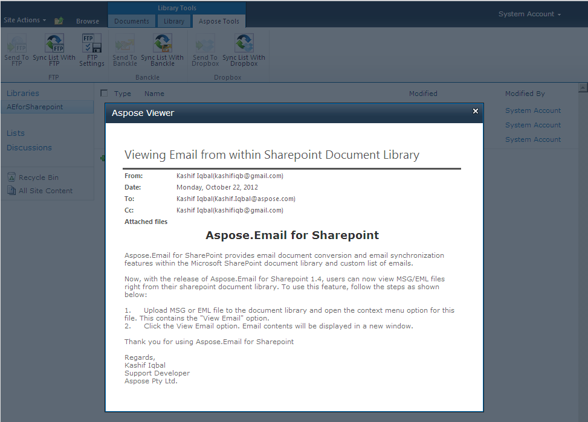

{} 

Aspose.Email for SharePoint supports viewing MSG and EML files from a SharePoint document library.

{} 
## **Viewing Emails**
To view emails from within a SharePoint Document library:

1. Upload MSG or EML files to the document library.
1. Open the context menu for the file. 
   You'll see the option **View Email**. 

   **The context menu for an email message as seen in a SharePoint message** 

1. Click the **View Email** option. 
   Email contents will be displayed in a new window. 

   **The Aspose.Email viewer showing an email from within a SharePoint library** 

