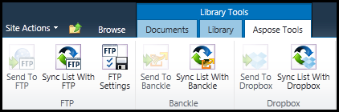

{} 

Aspose.Email's synchronization component provides features for transferring files and synchronizing files between the SharePoint document library and following file hosting/sharing services:

1. FTP server
1. Dropbox

{} 

When the Document Library Synchronization component has been [installed](/email/sharepoint/installing-aspose-email-for-/sharepoint/) and [activated](/email/sharepoint/activation-and-de-activation-after-installation/), the **Aspose Tools** ribbon is added to the document library. 

**The Aspose.Tools ribbon in the document library.** 

