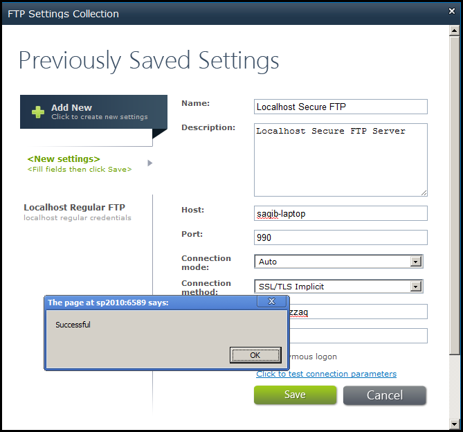

{} 

You can save one or more FTP settings with Aspose.Email for SharePoint. These settings can be used when transferring files or automatically synchronizing with an FTP server. This article explains how.

{} 

To access the FTP Settings: 

1. On the [**Aspose Tools** ribbon](/email/sharepoint/about-document-library-synchronization/), click **FTP Settings**.
   The FTP Settings Collections dialog is displayed.
1. Create, add or modify an FTP setting.
1. Click **Click to test connection parameters**.
   If the connection is successful, a message appears. 
1. Click **OK** to close the success message.
1. Click **Save** to save the settings and exit the dialog.

The FTP Settings Collections dialog allows you to:

- Create new FTP setting
- Modify an existing FTP setting
- Delete an existing FTP setting

**Settings specified for connecting to an SSL secured FTP server.** 

