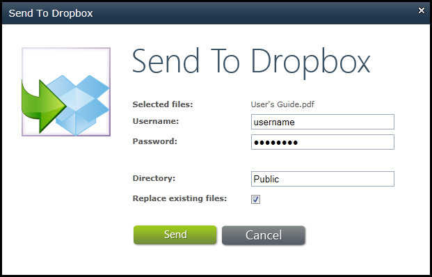
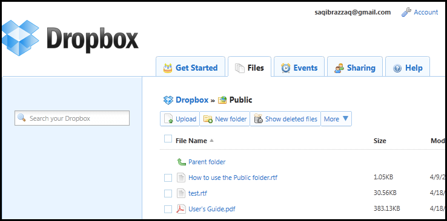

{} 

With Aspose.Email for SharePoint, you can select any file to send to Dropbox. This article explains how.

{} 

To send files to Dropbox:

1. In the document library, select a file.
1. Click **Send To Dropbox** from the **Aspose Tools** ribbon. 

   **Logging in to send files to Dropbox.** 

1. Specify the Dropbox credentials and directory name (optional) that the files should be transferred to.
1. Click **Send** to transfer the files.
   After successful transfer, the files are available from Dropbox. 

   **The transferred files in Dropbox.** 

