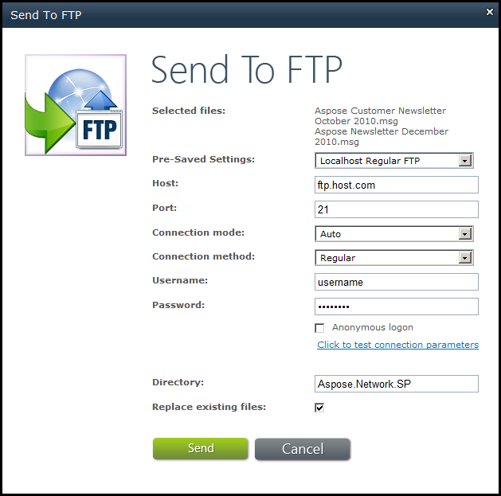

{} 

With Aspose.Email for SharePoint, you can select any file and send it to an FTP server. This article explains how.

{} 

1. In a document library, select a file.
1. Click **Send To FTP** on the **Aspose Tools** ribbon.
   The Send To FTP dialog is displayed. 

   **The Send to FTP dialog.** 

1. Enter the FTP server details.
1. Click **Send**.

{} 

You need to specify the FTP server credentials and the name of the directory where files should be transferred. Aspose.Email for SharePoint also supports SSL for FTP connections.

{}
