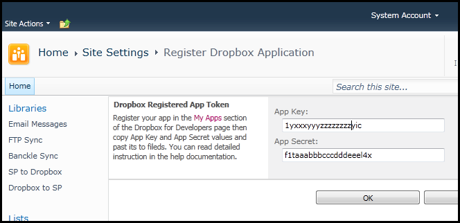

{} 

To do any operation with Dropbox using Aspose.Email for SharePoint, you need to register an application with Dropbox. More information can be found at <https://www.dropbox.com/developers/apps>. This article explains how to set up the connection in SharePoint.

{} 
## **Setting Up Transfer to Dropbox**
1. After creating and registering the application in Dropbox, get the **Key** and **Secret** values.
   This values must be registered with Aspose.Email for SharePoint for it to be able to call the Dropbox API to transfer/synchronize files. 
1. To register the values with Aspose.Email for SharePoint, click **Site Actions** and select **Site Settings** from the menu.
1. In the **Site Administration** category, click **Register Aspose Dropbox Sync**.
   A new page is opened. 
1. Enter the key and secret values.
1. Click **OK**. 

   **Setting up app key and app secret to be able to connect to Dropbox.** 

Now, you can transfer or synchronize files between SharePoint and Dropbox file services:

- [Send files to Dropbox](/email/sharepoint/send-selected-files-to-dropbox/).
- [Synchronize files with Dropbox](/email/sharepoint/synchronize-files-with-dropbox/).
