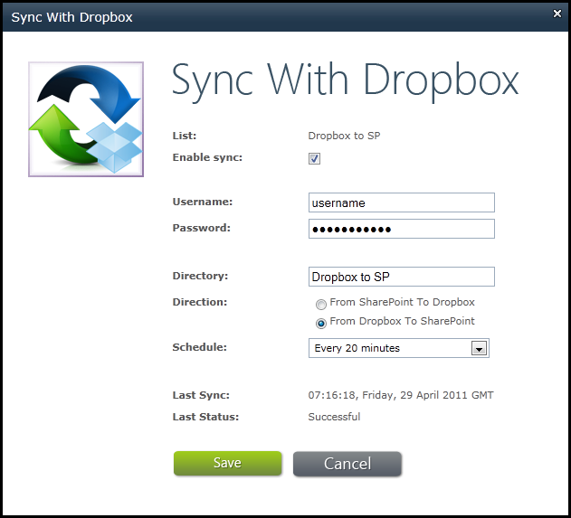

{} 

[Send Files to Dropbox](/email/sharepoint/send-selected-files-to-dropbox/), showed how to sending files to Dropbox. This is when there are several files in a SharePoint document library but we only want to transfer some of them.

If we need to automatically synchronize all files between Dropbox and SharePoint, the **Sync List with Dropbox** option is the better choice.

Aspose.Email for SharePoint allows synchronization in either direction:

- From SharePoint to Dropbox: all files are transferred to Dropbox after specified interval.
- From Dropbox to SharePoint: all files from Dropbox will be transferred to SharePoint after specified time interval.

In the illustration below, the synchronization goes from Dropbox to SharePoint. 

{} 
## **Synchronizing Files with Dropbox**
To setup the synchronization:

1. In a SharePOint document library, click **Sync List with Dropbox** on the **Aspose Tools** ribbon.
   The Sync with Dropbox dialog appears. 

   **Setting up Dropbox synchronization.** 

1. Provide the Dropbox authentication information, direction, and schedule.
1. Click **Save**.
   When the setting have been saved, all the files will be synchronized. 
