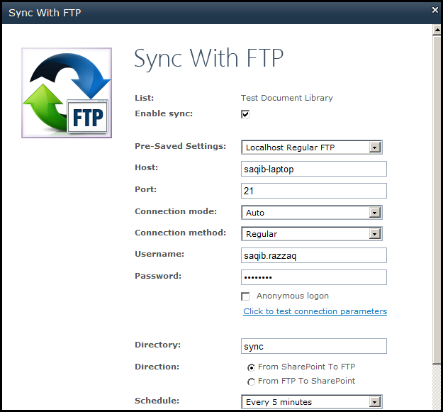

{} 

Aspose.Email for SharePoint lets you synchronize files between a SharePoint document library and an FTP server. This article explains how.

{} 
## **Synchronizing Files**
When setting up FTP synchronization, you can apply the following settings:

1. FTP credentials (host, port, connection mode, regular or SSL connection method, username and password).
1. The name of the folder on the FTP server that the files should be synced to.
1. The direction of the sync: 
   1. From SharePoint to FTP or
   1. From FTP to SharePoint.
1. Schedule (specify synchronization interval in minutes)

{} 

Either specify the FTP credentials manually in this window or load them using [previously saved settings](/email/sharepoint/ftp-settings/).

{} 

To do the synchronization:

1. Click **Sync List with FTP** on the **Aspose Tools** ribbon.
   The Sync with FTP dialog is displayed. 

   **The Sync with FTP dialog.** 

