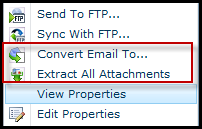

{} 

Aspose.Email for SharePint provides features for converting email messages and extracting attachments from email messages in a document library.

{} 

When the Email Conversion component has been [installed](/email/sharepoint/installing-aspose-email-for-sharepoint/) and [activated](/email/sharepoint/activation-and-de-activation-after-installation/), it adds two menu items to the context menu in a document library:

- [Convert Email To](/email/sharepoint/eml-to-msg-and-msg-to-eml-file-conversion/) lets you convert emails from EML to MSG, or MSG to EML.
- [Extract All Attachments](/email/sharepoint/extract-attachments-from-email/) extracts attachments from an email.

**The document library context menu showing the two options added by Aspose.Email's email conversion component.** 

{}
**Try it out!**

Convert emails & message archives online with the free [**Aspose.Email Conversion App**](https://products.aspose.app/email/Conversion).
{}
