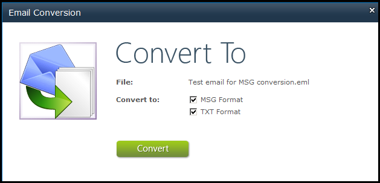
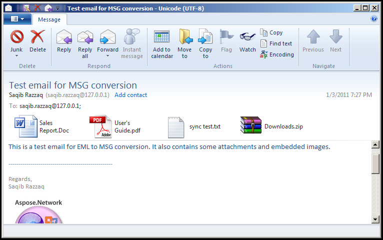
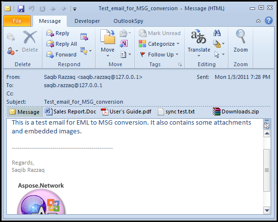

{} 

Any attachments and embedded images are included when converting from EML to MSG and vice versa. When converting to TXT format, only the text of message is saved.

{} 
## **Converting Email Messages**
{}
**Try it out!**

Convert emails & message archives online with the free [**Aspose.Email Conversion App**](https://products.aspose.app/email/Conversion).
{}
To convert a file:

1. In the document library, right-click a file.
1. Select **Convert Email To** from the menu.
   A new dialog is displayed. It shows the name of the file about to be converted and the output message format. 

   **The Email Conversion dialog.** 

1. Check the **MSG Format** and **TXT FOrmat** options.
1. Click **Convert**.
   The conversion starts.

If the conversion is successful, two new files (MSG and TXT) are added to the document library. 

**The original EML file opened in Windows Live Mail 2011.** 

**The converted MSG file in Outlook 2012.** 

