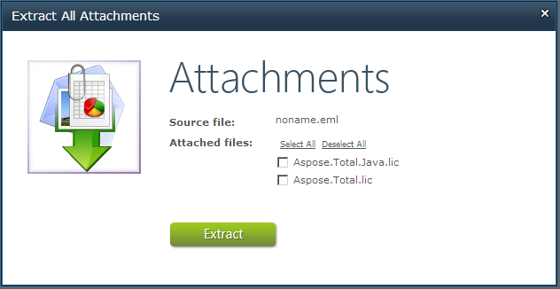
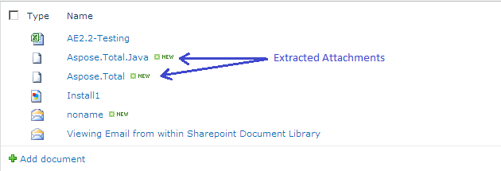

{} 

Aspose.Email for SharePoint allows the users to extract all or selected attachments from an email message contained in a document library. The format of the email message must be either EML or MSG.

{} 
## **Extracting Attachments**
To extract an email message's attachments:

1. Right-click the email in a document library.
1. Select **Extract All Attachments** from the menu.
   The Extract All Attachments dialog is displayed. It shows the name of the message and gives a list of attached files. 

   **The Extract All Attachments dialog.** 

1. Select the attachments that you want to save or click Select All to select all attachments.
1. Click **Extract**.
   The attachments are saved to the document library.

The screenshot below shows a document library that contains the MSG file used in this example, as well as the attachments extracted from it. 

**Extracted attachments are are to the document library.** 

