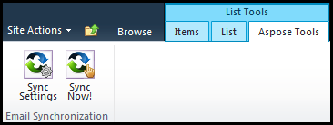

{} 

ASpose.EMail's Email Synchronization component allows you to synchronize emails with POP3, IMAP or Exchange Servers. 

{} 

After [installing](/email/sharepoint/installing-aspose-email-for-sharepoint/) and [activating](/email/sharepoint/activation-and-de-activation-after-installation/) the Email Synchronization component, an **Aspose Tools** ribbon is available in SharePoint’s custom list of emails. 

**The Aspose Tools ribbon showing email synchronization options.** 

Find out how to [synchronize emais with POP3](/email/sharepoint/synchronize-emails-using-pop3/).
