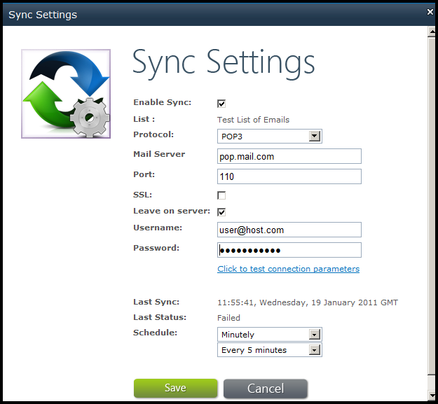

{} 

This article shows how to use the Aspose.Email's email synchronization feature to synchronize emails with a POP3 server. 

{} 
## **Synchronizing Emails**
1. In Click on “Sync Settings” menu item on the “Aspose Tools” ribbon to open the settings popup window. Enter the following information in this screen: 
   1. Enable Sync: check
   1. Protocol: POP3
   1. Mail server: pop.host.com (Your POP3 mail server address)
   1. Port: 110 (POP3 port)
   1. SSL: un-check
   1. Leave on Server: check
   1. Username: username@host.com (specify complete email address)
   1. Password: specify the password
   1. Schedule: choose “Minutely” and “Every 5 minutes” or whatever suits you 

      **The Sync Settings dialog set up to connect to a POP3 server.** 

1. Click **Click to test connection parameters** to verify the connection.
   If there is anything wrong with the credentials or host address, an error message is displayed.
1. Click **Save** to save the settings.

{} 

To start the synchronization immediately, click **Sync Now** on the Aspose Tools ribbon. 

{}
